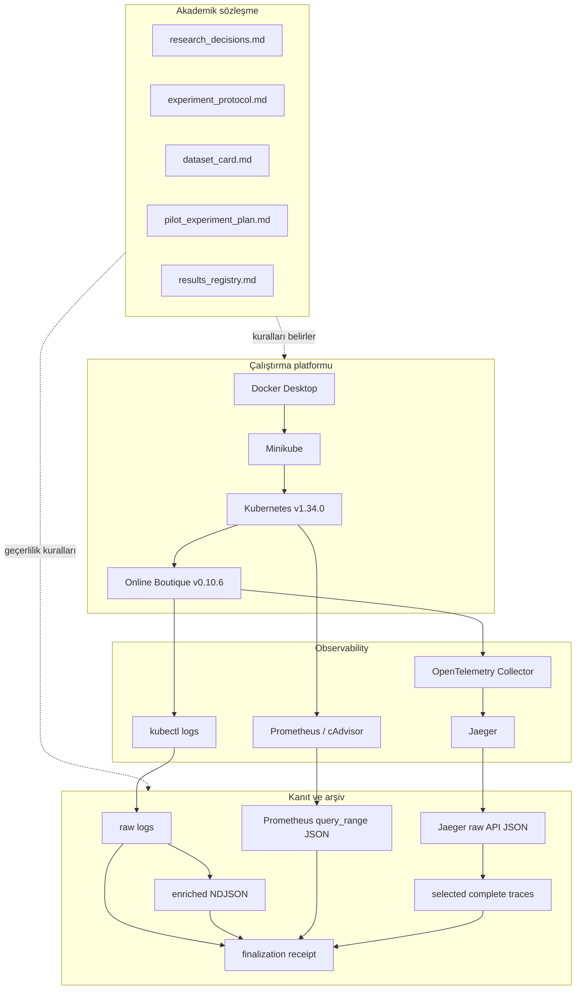
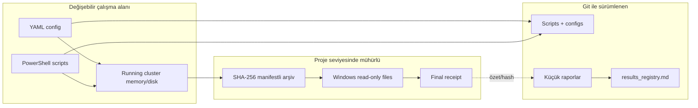

# Datasheet 01 — Proje Mimarisi

## 1. Sistem neyi araştırıyor?

Araştırmanın savunulabilir çekirdeği üç aşamalıdır:

1. Hata gerçekleşmeden önceki telemetri pencerelerinden temporal bir hata
   adayı üretmek.
2. Bu adayı zaman damgalı kanıtlarla LLM'e doğrulatmak.
3. Kök neden servisini graph tabanlı yöntemlerle sıralamak.

Repository'nin mevcut kodu yalnızca bu çalışmanın güvenilir veri üretebilmesi
için gereken operasyon katmanını uygular.

## 2. Katmanlar

## 3. Kontrol düzlemi ve veri düzlemi

### Kontrol düzlemi

Deneyi nasıl çalıştıracağımızı belirleyen dosyalardır:

- `p0-env/config/versions.yaml`
- `p0-env/config/online-boutique/*.yaml`
- `p0-env/scripts/*.ps1`
- run metadata ve profile dosyaları

### Veri düzlemi

Çalışan sistemden elde edilen kanıttır:

- Kubernetes log satırları
- Prometheus zaman serileri
- Jaeger trace/span kayıtları
- parsed/enriched loglar
- manifestler ve receipt'ler

Kontrol düzlemindeki bir değişiklik `deployment_revision` veya Git revision ile
izlenmeden veri düzlemine karıştırılamaz.

## 4. Güven sınırları

Windows read-only + SHA-256, proje seviyesinde değişmezlik sağlar; gerçek
donanım veya cloud WORM object lock değildir. Bu sınır raporlarda açıkça
belirtilir.

## 5. Neden Prometheus ve Jaeger içinde bırakmak yeterli değil?

Prometheus ve Jaeger deployment'larında kalıcı volume yoktur. Pod, cluster
veya host yeniden başlarsa veri kaybolabilir. Ayrıca aynı `run_id` ile
loadgenerator yeniden trafik üretirse eski run kontamine olur.

Bu nedenle run kapanırken:

- API yanıtları cluster dışına alınır,
- tam UTC sınırı kaydedilir,
- checksum manifesti üretilir,
- bağımsız verifier çalışır,
- bilimsel run ise sürümlü workload profili ile lifecycle/host-health metadata'sı doğrulanır,
- doğrulanmış metadata ve workload profili receipt dizinine checksum ile mühürlenir,
- sonra final receipt üretilir.

Normal workload'un tekrarlanabilirlik zinciri şöyledir:

`versioned JSON profile -> Kubernetes env -> Python random + Faker seed -> Locust -> scientific metadata verifier -> final receipt`

Sabit seed, kullanıcı davranışı için kullanılan sözde-rastgele üreticileri kontrol eder;
eşzamanlı isteklerin ağ ve scheduler kaynaklı tamamlanma sırasını deterministik yapmaz.
Bu nedenle profil ayrıca çalışan image, Locust/Faker sürümleri ve workload kodu
SHA-256 değerini sabitler.

## 6. Mimarinin şu anda uygulamadığı parçalar

Şu bileşenler tasarım belgelerinde vardır fakat kodlanmamıştır:

- CPU fault injector,
- run phase state machine,
- failure manifestation/SLO detector,
- 5 saniyelik feature window üretimi,
- grouped train/validation/test split,
- rule/logistic/XGBoost/GRU modelleri,
- LLM verifier,
- graph RCA ve GAT.

Bu ayrım önemlidir: observability pipeline'ın çalışması, araştırma hipotezinin
kanıtlandığı anlamına gelmez.
