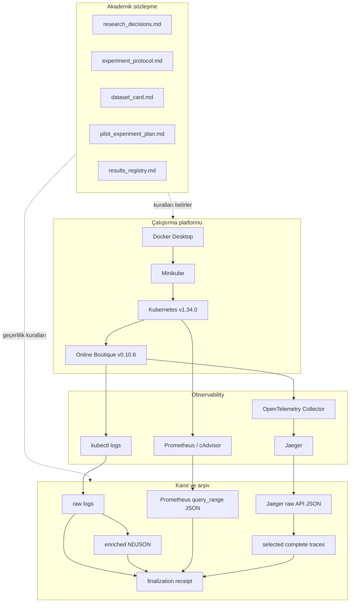
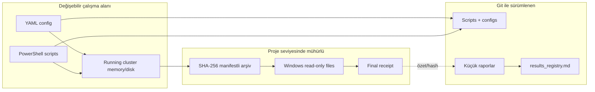

# Datasheet 01 — Proje Mimarisi

## 1. Sistem neyi araştırıyor?

Araştırmanın savunulabilir çekirdeği üç aşamalıdır:

1. Hata gerçekleşmeden önceki telemetri pencerelerinden temporal bir hata
   adayı üretmek.
2. Bu adayı zaman damgalı kanıtlarla LLM'e doğrulatmak.
3. Kök neden servisini graph tabanlı yöntemlerle sıralamak.

Repository'nin mevcut kodu yalnızca bu çalışmanın güvenilir veri üretebilmesi
için gereken operasyon katmanını uygular.

## 2. Katmanlar

## 3. Kontrol düzlemi ve veri düzlemi

### Kontrol düzlemi

Deneyi nasıl çalıştıracağımızı belirleyen dosyalardır:

- `p0-env/config/versions.yaml`
- `p0-env/config/online-boutique/*.yaml`
- `p0-env/scripts/*.ps1`
- run metadata ve profile dosyaları

### Veri düzlemi

Çalışan sistemden elde edilen kanıttır:

- Kubernetes log satırları
- Prometheus zaman serileri
- Jaeger trace/span kayıtları
- parsed/enriched loglar
- manifestler ve receipt'ler

Kontrol düzlemindeki bir değişiklik `deployment_revision` veya Git revision ile
izlenmeden veri düzlemine karıştırılamaz.

## 4. Güven sınırları

Windows read-only + SHA-256, proje seviyesinde değişmezlik sağlar; gerçek
donanım veya cloud WORM object lock değildir. Bu sınır raporlarda açıkça
belirtilir.

## 5. Neden Prometheus ve Jaeger içinde bırakmak yeterli değil?

Prometheus ve Jaeger deployment'larında kalıcı volume yoktur. Pod, cluster
veya host yeniden başlarsa veri kaybolabilir. Ayrıca aynı `run_id` ile
loadgenerator yeniden trafik üretirse eski run kontamine olur.

Bu nedenle run kapanırken:

- API yanıtları cluster dışına alınır,
- tam UTC sınırı kaydedilir,
- checksum manifesti üretilir,
- bağımsız verifier çalışır,
- bilimsel run ise sürümlü workload profili ile lifecycle/host-health metadata'sı doğrulanır,
- normal-baseline ölçüm penceresinin iki ucunda 15 deployment'ın pod UID ve toplam restart sayısı karşılaştırılır; değişiklik run'ı lifecycle belirsizliği nedeniyle reddeder,
- doğrulanmış metadata ve workload profili receipt dizinine checksum ile mühürlenir,
- sonra final receipt üretilir.

Normal workload'un tekrarlanabilirlik zinciri şöyledir:

`versioned JSON profile -> Kubernetes env -> Python random + Faker seed -> Locust -> scientific metadata verifier -> final receipt`

Sabit seed, kullanıcı davranışı için kullanılan sözde-rastgele üreticileri kontrol eder;
eşzamanlı isteklerin ağ ve scheduler kaynaklı tamamlanma sırasını deterministik yapmaz.
Bu nedenle profil ayrıca çalışan image, Locust/Faker sürümleri ve workload kodu
SHA-256 değerini sabitler.

Observability etkin run kimliği deployment sonrasında ayrı bir kapıyla doğrulanır:

`versioned run ID -> ConfigMap -> pod-template annotation/rollout -> canlı pod -> Prometheus runtime config -> run-scoped metric query`

Collector ve Prometheus pod-template annotation'ları run ID taşır. Kimlik değişikliği
Kubernetes rollout'unu tetikler; `verify-active-run-id.ps1` ConfigMap, canlı pod ve
Prometheus runtime API katmanlarının aynı kimliği taşıdığını doğrular. Kapı ayrıca
beklenen kimlikle gerçek metric serisi oluşmadan geçmez. Bu kontrol, yalnız YAML
dosyasının doğru olmasını çalışan process'in doğru config'i yüklediğiyle karıştırmayı
önler.

Frontend DNS A/B tooling'i, upstream checkout'u değiştirmeden `p0-env` Docker
context'inde bir patch uygular ve yerel image üretir. Test scripti loadgenerator'ı
geçici durdurur, ayrı istemci poduyla A/B/A ölçer ve `finally` bloğunda upstream
image, environment, replica ve pod durumunu geri yükler. Script yürütme başarısı
nedensel sonuç anlamına gelmez: cold-start ve DNS-cache carry-over nedeniyle
mevcut A/B attempt'leri invalid/inconclusive tutulur ve image bilimsel deployment'a
otomatik taşınmaz.

İkinci DNS A/B tasarımı, sıra/cold-start karışmasını azaltmak için upstream kontrol
ve patched treatment frontend'lerini aynı anda iki bağımsız deployment/service
olarak çalıştırır. Ayrı istemci podu sabit seed ile randomize edilen altı eşlenmiş
turda her varyanta on eşzamanlı `/` isteği gönderir. Warm-up batch'leri analizden
dışlanır; kabul ölçütleri sonuçtan önce `P1-FRONTEND-DNS-AB-002/preregistration.md`
içinde dondurulur. Geçici kaynaklar test sonunda silinir ve bu tooling çıktısı
bilimsel dataset'e otomatik girmez.

Lifecycle metadata'sı UTC değerlerini 1–7 kesir basamağıyla korur. Arşiv manifestleri
milisaniyeye normalize edebilse de scientific metadata verifier'a finalizer parametresi
olarak özgün UTC değeri aktarılır; farklı hassasiyetteki metinsel zamanlar doğrudan
eşit kabul edilmez.

Fault injector lifecycle UTC'lerini canonical trailing-`Z` biçiminde üretir.
Scientific metadata verifier geçersiz veya offset biçimli zamanı failure olarak
kaydeder, fakat null/çoklu çıktıyı duration aritmetiğine sokmaz. Böylece biçim
kusuru anlaşılır bir fail-closed sonucu verir; final receipt üretmeden run'ı
geçerli göstermez.

Hedef-servis seçimi, geçerli scientific metadata'daki normal-baseline UTC sınırını
okuyan `analyze-target-service-candidates.py` ile yeniden üretilebilir. Araç warm-up'ı,
health-check ve OTLP exporter spanlarını dışlar; cAdvisor CPU sayaç farklarını geçen
zamana bölerek millicore üretir ve adayların memory/trace/error özetini versioned JSON
olarak yazar. Invalid metadata analiz girdisi olarak reddedilir.

Normal SLI dağılımı `analyze-normal-slo-candidates.py` ile üç geçerli run'ın mühürlü
selected trace ve scientific metadata dosyalarından yeniden üretilir. Araç yalnız
frontend server spanlarını alır; health/telemetry trafiğini ve lifecycle sonundaki
eksik beş saniyelik kuyruğu dışlar. Her run için 60 eşit pencerenin p95 latency ve
error rate değerlerini yazar. Çıktı SLO kanıt adayıdır; araştırma kararını otomatik
olarak dondurmaz.

Route-specific karar desteği `analyze-route-specific-slo-candidates.py` ile aynı
mühürlü girdilerden global, exact `/` hariç ve normalize `/product/{id}` kullanıcı
nüfuslarını ayrı ayrı üretir. Her nüfus için boş pencereleri saklar; boş pencereye
latency uydurmaz ve yalnız dolu pencerelerin dağılımını hesaplar. Böylece route
kapsamı ile ölçüm yoğunluğu birlikte görülebilir. Çıktı bir SLO kararı değildir;
route nüfusunu değiştirmek Research Decision Log'da açık karar gerektirir.

Dondurulmuş pilot manifestation sözleşmesi
`p0-env/config/slo/p1-cpu-001-slo-v1.json` içinde makine-okunur ve sürümlüdür.
`verify-frozen-slo-on-normal-baselines.py`, bu sözleşmeyi route-specific normal
pencerelere yeniden uygular; boş pencereyi gözlenmemiş sayıp streak'i sıfırlar ve
her run için yanlış manifestation arar. Bu replay normal uyumluluğunu sınar;
fault duyarlılığını veya araştırma hipotezini kanıtlamaz.

İlk CPU fault yolu deployment'ı değiştirmez. Sürüm/hash sabitli
`cpu-recommendation-low-v1.json`, mevcut recommendationservice konteynerinde
`cpu-duty-worker.py` kodunu `invoke-cpu-stress.ps1` ile çalıştırır. Worker duty-cycle
talebini iki dakika ramp eder, beş dakika sabit tutar ve toplam süre sınırında
kendi kapanır. Injector yalnız yürütme kanıtı üretir; `analyze-cpu-fault-effect.py`
arşivlenmiş Prometheus CPU counter'larından baseline/steady farkını doğrulamadan
fault uygulanmış sayılmaz. Fault scientific metadata verifier profil, SLO, worker,
injector kanıtı, UTC evreleri, pod restart/UID ve host delta kapılarını uygular.
Final receipt fault profili, SLO ve injector kanıtının kopyalarını SHA-256 ile
mühürler; offline verifier bu ek dosyaları tekrar denetler.

`cpu-recommendation-low-v2.json`, injector veya deney şiddetini değiştirmez;
yalnız fiziksel-etki coverage sözleşmesini gerçek 5 saniyelik Prometheus scrape
cadence'ine uyarlar. Her 300 saniyelik baseline ve steady fazında beklenen 60
gerçek CPU-rate intervalinden en az 48'i zorunludur. Analyzer query-step ile
interpolasyon yapmaz; yalnız arşivlenmiş kaynak örnek çiftlerini sayar. `v1`
tarihsel immutable sözleşme olarak kalır ve `ob-cpu-low-002` invalid sonucunu
korur; orchestrator'ın sonraki varsayılanı `ob-cpu-low-003` + `v2`dir.

`cpu-recommendation-low-v3.json`, fault şiddetini değiştirmeden lifecycle zaman
kaynağını ayrıştırır. `cpu-duty-worker.py` canonical UTC taşıyan `started` ve
`completed` olayları üretir; `worker-lifecycle.ps1` bu iki olayı, UTC duvar saati
süresini ve monotonic süreyi doğrular. `invoke-cpu-stress.ps1` bilimsel injection
sınırlarını worker olaylarından alırken dış `kubectl exec` UTC değerlerini ayrı
tanısal alanlarda korur. Böylece taşıma gecikmesi telemetry ile hizalanan fault
penceresine eklenmez, fakat inceleme kanıtından da kaybolmaz.

`cpu-recommendation-low-v4.json` ve `worker-source-hash.ps1`, metin worker'ın
kimliğini working-tree satır sonundan ayırır. Kaynak önce UTF-8 BOM'suz/LF
canonical byte dizisine çevrilir ve SHA-256 bunun üzerinden hesaplanır. Profil
ile injector evidence normalizasyon yöntemini birlikte taşır; verifier ikisini
karşılaştırır. Böylece Windows CRLF ve Linux LF checkout aynı kaynak için aynı
hash'i üretirken gerçek içerik değişikliği bütünlük kapısında reddedilir.

`detect-fault-manifestation.py`, fault run selected trace katmanını dondurulmuş
SLO sözleşmesiyle değerlendirir. Tek zaman grid'i `normal_baseline_start_utc`
noktasında başlar ve cooldown sonuna kadar faz sınırlarında yeniden hizalanmaz.
Dedektör ürün latency ve global error streak'lerini ayrı yürütür, boş nüfus
penceresinde ilgili streak'i keser ve ilk tamamlanan üçüncü ihlal penceresinin
bitişini manifestation zamanı yapar. Bu çıktı scientific metadata ve final
receipt içine hash ile bağlanır; operatörün elle zaman seçmesi engellenir.

`run-low-cpu-calibration.ps1` bu bileşenleri fail-closed sırayla bağlayan lifecycle
orchestrator'dır. Temiz Git revision ve boş artifact yollarıyla başlar; warm-up,
baseline, injection ve cooldown UTC'lerini/pod snapshot'larını kaydeder; log ve
telemetry arşivlerini doğrular; fiziksel etki ile manifestation analizlerini
çalıştırır; post-host kapısı için cluster'ı durdurur. Yalnız effect, pod continuity,
host delta, metadata ve offline receipt kapılarının tamamı geçerse run valid olur.
Hata halinde `finally` cluster'ı durdurur ve kısmi kanıtı silmez.

`analyze-frontend-root-critical-path.py`, normal `/` trace'lerinde frontend server
spanıyla aynı trace'deki en uzun spanı karşılaştırır; paralel spanları toplamaz ve
sonucu nedensel kanıt değil kritik-yol adayı olarak etiketler. Bu sınır, trace'de
görünmeyen uygulama/DNS beklemelerinin yanlışlıkla downstream servise yüklenmesini
önler.

## 6. Mimarinin şu anda uygulamadığı parçalar

Şu bileşenler tasarım belgelerinde vardır fakat kodlanmamıştır:

- CPU fault injector,
- run phase state machine,
- failure manifestation/SLO detector,
- 5 saniyelik feature window üretimi,
- grouped train/validation/test split,
- rule/logistic/XGBoost/GRU modelleri,
- LLM verifier,
- graph RCA ve GAT.

Bu ayrım önemlidir: observability pipeline'ın çalışması, araştırma hipotezinin
kanıtlandığı anlamına gelmez.
