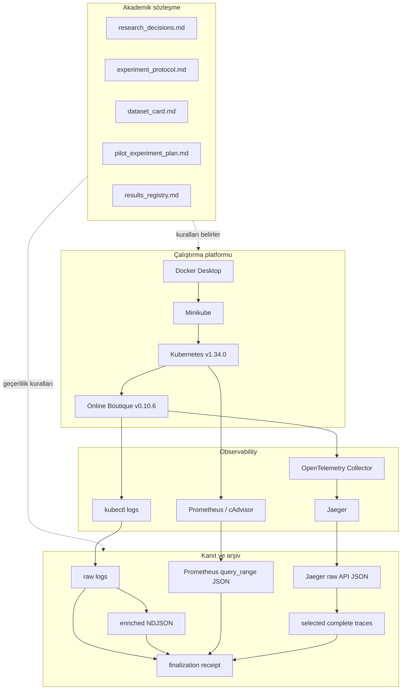
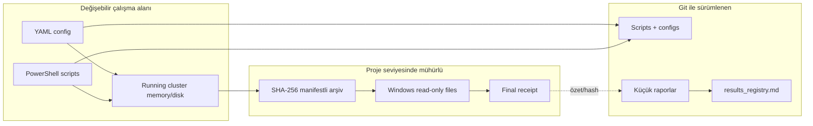

# Datasheet 01 — Proje Mimarisi

## 1. Sistem neyi araştırıyor?

Araştırmanın savunulabilir çekirdeği üç aşamalıdır:

1. Hata gerçekleşmeden önceki telemetri pencerelerinden temporal bir hata
   adayı üretmek.
2. Bu adayı zaman damgalı kanıtlarla LLM'e doğrulatmak.
3. Kök neden servisini graph tabanlı yöntemlerle sıralamak.

Repository'nin mevcut kodu yalnızca bu çalışmanın güvenilir veri üretebilmesi
için gereken operasyon katmanını uygular.

## 2. Katmanlar

## 3. Kontrol düzlemi ve veri düzlemi

### Kontrol düzlemi

Deneyi nasıl çalıştıracağımızı belirleyen dosyalardır:

- `p0-env/config/versions.yaml`
- `p0-env/config/online-boutique/*.yaml`
- `p0-env/scripts/*.ps1`
- run metadata ve profile dosyaları

### Veri düzlemi

Çalışan sistemden elde edilen kanıttır:

- Kubernetes log satırları
- Prometheus zaman serileri
- Jaeger trace/span kayıtları
- parsed/enriched loglar
- manifestler ve receipt'ler

Kontrol düzlemindeki bir değişiklik `deployment_revision` veya Git revision ile
izlenmeden veri düzlemine karıştırılamaz.

## 4. Güven sınırları

Windows read-only + SHA-256, proje seviyesinde değişmezlik sağlar; gerçek
donanım veya cloud WORM object lock değildir. Bu sınır raporlarda açıkça
belirtilir.

## 5. Neden Prometheus ve Jaeger içinde bırakmak yeterli değil?

Prometheus ve Jaeger deployment'larında kalıcı volume yoktur. Pod, cluster
veya host yeniden başlarsa veri kaybolabilir. Ayrıca aynı `run_id` ile
loadgenerator yeniden trafik üretirse eski run kontamine olur.

Bu nedenle run kapanırken:

- API yanıtları cluster dışına alınır,
- tam UTC sınırı kaydedilir,
- checksum manifesti üretilir,
- bağımsız verifier çalışır,
- bilimsel run ise sürümlü workload profili ile lifecycle/host-health metadata'sı doğrulanır,
- normal-baseline ölçüm penceresinin iki ucunda 15 deployment'ın pod UID ve toplam restart sayısı karşılaştırılır; değişiklik run'ı lifecycle belirsizliği nedeniyle reddeder,
- doğrulanmış metadata ve workload profili receipt dizinine checksum ile mühürlenir,
- sonra final receipt üretilir.

Normal workload'un tekrarlanabilirlik zinciri şöyledir:

`versioned JSON profile -> Kubernetes env -> Python random + Faker seed -> Locust -> scientific metadata verifier -> final receipt`

Sabit seed, kullanıcı davranışı için kullanılan sözde-rastgele üreticileri kontrol eder;
eşzamanlı isteklerin ağ ve scheduler kaynaklı tamamlanma sırasını deterministik yapmaz.
Bu nedenle profil ayrıca çalışan image, Locust/Faker sürümleri ve workload kodu
SHA-256 değerini sabitler.

Observability etkin run kimliği deployment sonrasında ayrı bir kapıyla doğrulanır:

`versioned run ID -> ConfigMap -> pod-template annotation/rollout -> canlı pod -> Prometheus runtime config -> run-scoped metric query`

Collector ve Prometheus pod-template annotation'ları run ID taşır. Kimlik değişikliği
Kubernetes rollout'unu tetikler; `verify-active-run-id.ps1` ConfigMap, canlı pod ve
Prometheus runtime API katmanlarının aynı kimliği taşıdığını doğrular. Kapı ayrıca
beklenen kimlikle gerçek metric serisi oluşmadan geçmez. Bu kontrol, yalnız YAML
dosyasının doğru olmasını çalışan process'in doğru config'i yüklediğiyle karıştırmayı
önler.

Frontend DNS A/B tooling'i, upstream checkout'u değiştirmeden `p0-env` Docker
context'inde bir patch uygular ve yerel image üretir. Test scripti loadgenerator'ı
geçici durdurur, ayrı istemci poduyla A/B/A ölçer ve `finally` bloğunda upstream
image, environment, replica ve pod durumunu geri yükler. Script yürütme başarısı
nedensel sonuç anlamına gelmez: cold-start ve DNS-cache carry-over nedeniyle
mevcut A/B attempt'leri invalid/inconclusive tutulur ve image bilimsel deployment'a
otomatik taşınmaz.

İkinci DNS A/B tasarımı, sıra/cold-start karışmasını azaltmak için upstream kontrol
ve patched treatment frontend'lerini aynı anda iki bağımsız deployment/service
olarak çalıştırır. Ayrı istemci podu sabit seed ile randomize edilen altı eşlenmiş
turda her varyanta on eşzamanlı `/` isteği gönderir. Warm-up batch'leri analizden
dışlanır; kabul ölçütleri sonuçtan önce `P1-FRONTEND-DNS-AB-002/preregistration.md`
içinde dondurulur. Geçici kaynaklar test sonunda silinir ve bu tooling çıktısı
bilimsel dataset'e otomatik girmez.

Lifecycle metadata'sı UTC değerlerini 1–7 kesir basamağıyla korur. Arşiv manifestleri
milisaniyeye normalize edebilse de scientific metadata verifier'a finalizer parametresi
olarak özgün UTC değeri aktarılır; farklı hassasiyetteki metinsel zamanlar doğrudan
eşit kabul edilmez.

Fault injector lifecycle UTC'lerini canonical trailing-`Z` biçiminde üretir.
Scientific metadata verifier geçersiz veya offset biçimli zamanı failure olarak
kaydeder, fakat null/çoklu çıktıyı duration aritmetiğine sokmaz. Böylece biçim
kusuru anlaşılır bir fail-closed sonucu verir; final receipt üretmeden run'ı
geçerli göstermez.

Hedef-servis seçimi, geçerli scientific metadata'daki normal-baseline UTC sınırını
okuyan `analyze-target-service-candidates.py` ile yeniden üretilebilir. Araç warm-up'ı,
health-check ve OTLP exporter spanlarını dışlar; cAdvisor CPU sayaç farklarını geçen
zamana bölerek millicore üretir ve adayların memory/trace/error özetini versioned JSON
olarak yazar. Invalid metadata analiz girdisi olarak reddedilir.

Normal SLI dağılımı `analyze-normal-slo-candidates.py` ile üç geçerli run'ın mühürlü
selected trace ve scientific metadata dosyalarından yeniden üretilir. Araç yalnız
frontend server spanlarını alır; health/telemetry trafiğini ve lifecycle sonundaki
eksik beş saniyelik kuyruğu dışlar. Her run için 60 eşit pencerenin p95 latency ve
error rate değerlerini yazar. Çıktı SLO kanıt adayıdır; araştırma kararını otomatik
olarak dondurmaz.

Route-specific karar desteği `analyze-route-specific-slo-candidates.py` ile aynı
mühürlü girdilerden global, exact `/` hariç ve normalize `/product/{id}` kullanıcı
nüfuslarını ayrı ayrı üretir. Her nüfus için boş pencereleri saklar; boş pencereye
latency uydurmaz ve yalnız dolu pencerelerin dağılımını hesaplar. Böylece route
kapsamı ile ölçüm yoğunluğu birlikte görülebilir. Çıktı bir SLO kararı değildir;
route nüfusunu değiştirmek Research Decision Log'da açık karar gerektirir.

Dondurulmuş pilot manifestation sözleşmesi
`p0-env/config/slo/p1-cpu-001-slo-v1.json` içinde makine-okunur ve sürümlüdür.
`verify-frozen-slo-on-normal-baselines.py`, bu sözleşmeyi route-specific normal
pencerelere yeniden uygular; boş pencereyi gözlenmemiş sayıp streak'i sıfırlar ve
her run için yanlış manifestation arar. Bu replay normal uyumluluğunu sınar;
fault duyarlılığını veya araştırma hipotezini kanıtlamaz.

İlk CPU fault yolu deployment'ı değiştirmez. Sürüm/hash sabitli
`cpu-recommendation-low-v1.json`, mevcut recommendationservice konteynerinde
`cpu-duty-worker.py` kodunu `invoke-cpu-stress.ps1` ile çalıştırır. Worker duty-cycle
talebini iki dakika ramp eder, beş dakika sabit tutar ve toplam süre sınırında
kendi kapanır. Injector yalnız yürütme kanıtı üretir; `analyze-cpu-fault-effect.py`
arşivlenmiş Prometheus CPU counter'larından baseline/steady farkını doğrulamadan
fault uygulanmış sayılmaz. Fault scientific metadata verifier profil, SLO, worker,
injector kanıtı, UTC evreleri, pod restart/UID ve host delta kapılarını uygular.
Final receipt fault profili, SLO ve injector kanıtının kopyalarını SHA-256 ile
mühürler; offline verifier bu ek dosyaları tekrar denetler.

D-038 hedef stabilite sınırı `verify-target-pod-stability.ps1` ile warm-up öncesinde
çalışır. Verifier hedef podu 5 saniyede bir 120 saniye gözler; tek pod, Ready durumu,
beklenen container, pod UID, container ID ve restart sayısının değişmemesini ister ve
read-only kanıt üretir. `run-low-cpu-calibration.ps1` bu kapıyı lifecycle'dan önce
çağırır; `invoke-cpu-stress.ps1` worker exec'ten hemen önce canlı kimliği kanıtın final
snapshot'ıyla karşılaştırır. Retry yoktur. Stabilite kanıtının SHA-256 değeri injector
execution evidence içine girerek mevcut final receipt zincirine bağlanır. Böylece
hazırlık süresi artar fakat 300/300/120/300/300 bilimsel lifecycle değişmez.

D-039 minimum faz süresi sınırı `phase-duration.ps1` ile uygulanır. Runner,
warm-up, normal baseline ve cooldown için kaydedilmiş başlangıç UTC'sinden 300
saniyelik deadline hesaplar; deadline görülmeden canonical bitiş UTC'si üretmez.
Bu katman verifier toleransı eklemez ve lifecycle süresini değiştirmez; işletim
sistemi sleep çağrısının birkaç milisaniye erken dönmesini fail-safe biçimde
absorbe eder. `test-phase-duration.ps1` erken dönüş negatifini ve runner'daki üç
guard bağını doğrular.

`cpu-recommendation-low-v2.json`, injector veya deney şiddetini değiştirmez;
yalnız fiziksel-etki coverage sözleşmesini gerçek 5 saniyelik Prometheus scrape
cadence'ine uyarlar. Her 300 saniyelik baseline ve steady fazında beklenen 60
gerçek CPU-rate intervalinden en az 48'i zorunludur. Analyzer query-step ile
interpolasyon yapmaz; yalnız arşivlenmiş kaynak örnek çiftlerini sayar. `v1`
tarihsel immutable sözleşme olarak kalır ve `ob-cpu-low-002` invalid sonucunu
korur; orchestrator'ın sonraki varsayılanı `ob-cpu-low-003` + `v2`dir.

`cpu-recommendation-low-v3.json`, fault şiddetini değiştirmeden lifecycle zaman
kaynağını ayrıştırır. `cpu-duty-worker.py` canonical UTC taşıyan `started` ve
`completed` olayları üretir; `worker-lifecycle.ps1` bu iki olayı, UTC duvar saati
süresini ve monotonic süreyi doğrular. `invoke-cpu-stress.ps1` bilimsel injection
sınırlarını worker olaylarından alırken dış `kubectl exec` UTC değerlerini ayrı
tanısal alanlarda korur. Böylece taşıma gecikmesi telemetry ile hizalanan fault
penceresine eklenmez, fakat inceleme kanıtından da kaybolmaz.

`cpu-recommendation-low-v4.json` ve `worker-source-hash.ps1`, metin worker'ın
kimliğini working-tree satır sonundan ayırır. Kaynak önce UTF-8 BOM'suz/LF
canonical byte dizisine çevrilir ve SHA-256 bunun üzerinden hesaplanır. Profil
ile injector evidence normalizasyon yöntemini birlikte taşır; verifier ikisini
karşılaştırır. Böylece Windows CRLF ve Linux LF checkout aynı kaynak için aynı
hash'i üretirken gerçek içerik değişikliği bütünlük kapısında reddedilir.

Injector worker JSON olaylarını `Generic.List[object]` içinde toplar ve
`worker-lifecycle.ps1` resolver'ına açık `.ToArray()` dönüşümüyle verir. Bu sınır
Windows PowerShell 5.1'in `@($genericList)` array-subexpression binder kusurunu
önler. Regression fixture üretimdeki koleksiyon tipini aynen kurar; yalnız normal
PowerShell array fixture'ına güvenmez.

CPU calibration orchestrator, açık `FaultProfileRelative` parametresiyle
sürümlenmiş low, medium veya high profili okur; metadata profil kimliği ve operator
notunu dosyadan türetir. Injector ve scientific metadata verifier profil-ID
başına severity, requested mCPU, minimum fiziksel artış ve coverage sözleşmesini
kapalı bir haritada doğrular. Böylece yeni severity desteği önceki kontrolleri
gevşetmez; high yalnız requested 150m ve minimum 75m fiziksel etkiyi değiştirir.

Fiziksel-etki analyzer'ı aynı pod/container için birden fazla cAdvisor counter
serisi bulunduğunda baseline ve steady fazlarının ikisini de kapsayan tam olarak
bir CPU serisi ister. Sıfır veya birden fazla lifecycle-kapsayan seri fail-closed
reddedilir; seriler toplanmaz ve yalnız en uzun seri olduğu için seçilmez.
Throttling, seçilen CPU serisinin aynı cgroup `id` değerine bağlanır. Bu sınır,
warm-up öncesi container restart kalıntısının aktif ölçüm serisini gölgelemesini
önlerken gerçek çoklu-seri belirsizliğini görünür tutar.

`detect-fault-manifestation.py`, fault run selected trace katmanını dondurulmuş
SLO sözleşmesiyle değerlendirir. Tek zaman grid'i `normal_baseline_start_utc`
noktasında başlar ve cooldown sonuna kadar faz sınırlarında yeniden hizalanmaz.
Dedektör ürün latency ve global error streak'lerini ayrı yürütür, boş nüfus
penceresinde ilgili streak'i keser ve ilk tamamlanan üçüncü ihlal penceresinin
bitişini manifestation zamanı yapar. Bu çıktı scientific metadata ve final
receipt içine hash ile bağlanır; operatörün elle zaman seçmesi engellenir.

`run-low-cpu-calibration.ps1` bu bileşenleri fail-closed sırayla bağlayan lifecycle
orchestrator'dır. Temiz Git revision ve boş artifact yollarıyla başlar; warm-up,
baseline, injection ve cooldown UTC'lerini/pod snapshot'larını kaydeder; log ve
telemetry arşivlerini doğrular; fiziksel etki ile manifestation analizlerini
çalıştırır; post-host kapısı için cluster'ı durdurur. Yalnız effect, pod continuity,
host delta, metadata ve offline receipt kapılarının tamamı geçerse run valid olur.
Hata halinde `finally` cluster'ı durdurur ve kısmi kanıtı silmez.

D-030 workload kapasite yolu bilimsel fault veri yolundan ayrıdır.
`set-workload-profile.ps1`, sürümlü aday JSON'daki profile ID, user ve spawn-rate
değerlerini loadgenerator patch'ine exact-match ile bağlar.
`run-workload-capacity.ps1` fault uygulamadan active run-ID, 300 saniye warm-up,
300 saniye measurement, 15-pod continuity, immutable log/schema-v3 telemetry ve
post-stop host kapılarını toplar. `analyze-workload-capacity.py` request-intensity,
frozen-SLO streak ve recommendationservice CPU headroom'unu sealed telemetry'den
yeniden hesaplar; `select-workload-capacity.py` yalnız ön-kayıtlı D-030 eşiklerini
uygular. Bu tooling artifact'ları `dataset_inclusion=false` taşır ve bilimsel
normal/fault run yerine geçmez.

D-031 sonrasında kapasite assessment'ı yalnız pod-stability boolean'ı değil,
measurement öncesi/sonrası tüm 15 pod UID/restart snapshot'ını saklar. CPU
headroom hesabı kaydedilmiş recommendationservice podu için measurement'ın iki
ucunu kapsayan tam olarak bir cAdvisor counter serisi ister; eski kısa seri veya
gerçek çoklu-seri belirsizliği fail-closed reddedilir.

Kapasite runner'ı tarihsel 10-user profilindeki `normal_baseline_seconds` ile yeni
aday profillerdeki `measurement_seconds` alanlarını aynı internal measurement
süresine normalize eder ve değer `300` saniye değilse durur. Bu uyumluluk katmanı
tarihsel workload dosyasını veya receipt hash'lerini geriye dönük değiştirmez.

`analyze-workload-resource-budget.py`, D-030'un mühürlü 10/15/20-user özetleri,
sürümlü high fault profili ve üç-run high özetinden O-010 için salt karar desteği
üretir. Araç request-intensity enterpolasyonunu ve normal CPU + high etki bütçesini
hesaplar, fakat doğrusal/toplamsal varsayımları deneysel kanıt olarak etiketlemez;
workload, eşik, fault profili veya CPU limiti seçmez. Böylece D-030 sonucu
retroaktif değiştirilmeden yeni preregistration seçenekleri yeniden hesaplanabilir.

D-033 ikinci bilimsel workload'u `ob-second-15u-1r-v1` ile kapasite-decision
profilinden ayrı kimlikte tutar. Workload'a özgü low/medium/high fault profilleri
kaynak 10-user profillerindeki injector, hedef, limit, lifecycle, SLO ve fiziksel
etki sözleşmesini aynen taşır; yalnız profil kimliği ve workload bağı değişir.
`invoke-cpu-stress.ps1` ile scientific metadata verifier aynı 10-user/15-user
profil allowlist sözleşmesini uygular. `test-second-workload-injector-profiles.ps1`,
üç 15-user profilini gerçek fault oluşturmayan `-WhatIf` yolunda kabul ettirir ve
değiştirilmiş fiziksel-etki eşiğini negatif fixture ile reddettirir. Böylece profil
dosyasının statik eş-fizik testi ile injector'ın çalışma zamanı kabul kapısı ayrı
ve tamamlayıcı doğrulama sınırlarıdır.
Uzun fault runner lifecycle'ı ölçümden sonra schema-v3 export, offline verifier,
scientific metadata ve final receipt kapanışını aynı fail-closed zincirde yürütür.
Dış orchestrator timeout'u bu zincirin parçası değildir fakat zinciri yarıda
kesmemesi için en az 60 dakika ayrılır. Timeout'a uğrayan run, fiziksel etki ve
telemetry tanısal olarak doğrulansa bile eksik metadata/receipt nedeniyle
retroaktif valid yapılmaz.
`test-second-workload-profiles.py` izin verilen bağlam alanlarını çıkardıktan sonra
profil çiftlerinin eşitliğini denetler. Bu ayrım kapasite tooling kanıtının bilimsel
dataset provenance'ıyla karışmasını önler.

D-034 ile workload runtime güven zinciri
`versioned workload -> kustomization -> loadgenerator deployment -> Ready pod -> scientific metadata`
olarak genişletilir. `verify-active-workload-profile.ps1` users, spawn rate, profil
kimliği ve seed'in dört katmanda eşleşmesini ister. Fault orchestrator aynı workload
dosyasından metadata üretir; fault metadata verifier profil içindeki workload bağını
metadata ile karşılaştırır. Yanlış 10u/15u eşleştirmesi final receipt öncesinde
fail-closed reddedilir.

`run-scientific-normal-baseline.ps1`, kapasite tooling yolundan ayrı scientific
normal kontrol düzlemidir. Akış `clean revision -> active run/workload -> warm-up ->
15-pod baseline snapshotları -> immutable log/telemetry -> normal SLO -> cluster stop
-> host delta -> scientific metadata -> final receipt -> offline verify` sırasını
izler. Script fault profili veya injector çağrısı içermez. `<=40m` workload seçim
provenance'ında kalır; normal CPU gözlemi raporlanır fakat sonuç-sonrası run dışlama
kuralı yapılmaz.

`analyze-frontend-root-critical-path.py`, normal `/` trace'lerinde frontend server
spanıyla aynı trace'deki en uzun spanı karşılaştırır; paralel spanları toplamaz ve
sonucu nedensel kanıt değil kritik-yol adayı olarak etiketler. Bu sınır, trace'de
görünmeyen uygulama/DNS beklemelerinin yanlışlıkla downstream servise yüklenmesini
önler.

D-040 sonrasında CPU stress telemetry ve injection-target kanıtları RCA değerlendirmesi
için korunur; proactive prediction sınıfı olarak yeni pencere üretmez. Kademeli
network delay ayrı bir P2 tasarım sınırıdır: önce sealed normal trace'lerden hedef
caller-to-callee edge seçimi, ardından injector izolasyonu ve cleanup tooling'i,
sonra ayrı sürümlü fault/SLO profili ve bilimsel run ön-kaydı gelir. Mevcut workload
podları capability'leri düşürür ve repository `NET_ADMIN`/`netem` injector içermez;
bu nedenle pod-ağında `tc`, açık proxy ve service-mesh seçenekleri güvenlik ve
karıştırıcı değişken açısından karşılaştırılmadan çalışma deployment'ına eklenmez.
Bu akış P1 receipt'lerini veya CPU etiketlerini değiştirmez.

D-041 ile tasarım/tooling sınırı somutlaştı. `analyze-network-delay-edge-candidates.py`
sealed normal trace'lerde caller client spanlarını callee parent-child bağıyla ve
5 saniyelik baseline pencereleriyle çıkarır. Seçilen
`recommendationservice -> productcatalogservice` edge'i için
`config/network-delay-design` overlay'i aynı pod network namespace'indeki
digest-pinned Toxiproxy sidecar'a yalnız `PRODUCT_CATALOG_SERVICE_ADDR` üzerinden
yönlendirir; sidecar privilege yükseltmez ve bütün capability'leri düşürür.
`manage-network-delay-proxy.py` bu aşamada toxic oluşturamaz, yalnız temiz durumu
doğrular veya `/reset` sonrası API state'ini geri okur. Birleşik tasarım verifier'ı
edge/SLO normal replay'lerini, profil-overlay bağını, fiziksel-etki kontratını ve
scientific-run yetkisizliğini tek receipt'e bağlar. Overlay henüz canlı deployment'a
uygulanmamıştır; bir sonraki mimari sınır fault içermeyen proxy-overhead/pod continuity
doğrulamasıdır.

D-042 ile no-toxic overlay canlı kümede uygulandı ve geri alındı.
`run-network-delay-proxy-live.ps1`, base warmup/ölçüm -> proxy rollout/API clean ->
stabilizasyon/ölçüm -> schema-v3 archive -> rollback -> host delta akışını fault
endpoint'i olmadan yürütür. `analyze-network-delay-proxy-live.py`, sealed trace'lerde
base/proxy target-edge coverage ve median overhead'i, route SLO replay'i, full-pod
snapshotları ve cleanup/host kanıtıyla birleştirir. Dört artifact kökü final receipt
ile hash'lenir ve servisler kapalıyken offline verifier tarafından yeniden oynatılır.
Canlı gate sonrası çalışma deployment'ı base tek-container recommendationservice ve
doğrudan productcatalogservice adresine dönmüştür; Minikube durdurulmuştur.

D-043, ilk scientific lifecycle'ı `run-network-delay-scientific.ps1` ile kodlar.
Runner explicit execution switch olmadan durur; fresh host/cluster/run-ID/workload,
canlı proxy container/security sözleşmesi, temiz API state ve 120 saniyelik target
pod stability sonrasında warmup -> baseline -> deadline-bound toxic ramp -> steady ->
API reset -> cooldown akışını yürütür. `manage-network-delay-toxic.py` her ramp
adımını geri okur; `analyze-network-delay-fault-effect.py` schema-v3 trace'lerde
coverage ve ölçülmüş edge latency farkını hesaplar. Metadata verifier valid iddiası
için bütün kapıları ister; invalid iddiasında başarısız kapının eksiksiz kaydını kabul
ederek kanıtın kapanmasına izin verir. Fault sonrası beklenmeyen hata oluşursa runner
rollback'ten önce best-effort raw/schema-v3 acil arşiv dener. Bu kod bu aşamada canlı
çalıştırılmamış, yalnız contract/fixture ve birleşik prereg verifier ile sınanmıştır.

İlk canlı kullanımda PowerShell 7'nin `ConvertFrom-Json` ISO UTC değerini otomatik
`System.DateTime`a çevirdiği ve `[string]` dönüşümünün canonical `Z` bilgisini
kaybettiği gözlendi. Deadline guard doğru biçimde steady başlangıcını reddetti;
runner emergency cleanup, raw/schema-v3 capture, base rollback ve cluster stop yaptı.
`finalize-invalid-run-artifacts.py`, normal finalizer'ın yanlış `valid_for_modeling=true`
iddiasını kullanmadan invalid attempt'in raw/enriched/telemetry ve lifecycle/host/
cleanup/rollback manifest hashlerini `finalized-invalid` receipt'e bağlar;
`verify-invalid-run-receipt.py` bunu servisler kapalıyken yeniden doğrular. Bu araç
geçerlilik üretmez ve eksik steady/cooldown verisini tamamlamaz.

D-044 ile `canonical-utc.ps1`, JSON katmanından gelen typed `DateTime`/`DateTimeOffset`
ve canonical string değerlerini invariant `Z` temsiline normalize eder; locale
stringleri reddeder. Runner ramp ve cleanup UTC sınırlarını bu helper üzerinden
deadline guard'a verir. `test-canonical-utc.ps1` PowerShell 7'nin gerçek typed JSON
davranışını ve locale negatif örneğini sınar. Replacement run ID
`ob-netdelay-15u-002`dir; mimari akış ve bilimsel eşikler değişmemiştir.

İlk tam replacement lifecycle'ında network-delay-specific metadata verifier geçti,
ancak generic `finalize-run-artifacts.ps1` içindeki fault verifier CPU profiline özgü
`severity` alanına doğrudan erişti. Bu katman uyuşmazlığı normal final receipt'i
engelledi ve run'ı invalid yaptı. Bilimsel effect/manifestation dosyaları korunur,
fakat receipt kapısı olmadan modeling'e girmez. Invalid receipt aracı normal cleanup,
effect/manifestation ve scientific metadata hashlerini de bağlayacak şekilde
genişletildi. Windows read-only attribute ve byte-level JSON hashlerinin Git checkout
sonrası taşınabilirliği O-016 altında ayrıca çözülmelidir; mevcut receipt çalışma anı
kanıtıdır, portable-valid iddiası değildir.

D-045 ile generic metadata dispatcher fault class'ı açıkça ayırır: `cpu_stress`
mevcut CPU verifier'ına, `network_delay` kendi edge-latency/lifecycle verifier'ına
gider; bilinmeyen sınıf fail-closed reddedilir. Invalid receipt schema v2 JSON
içeriğini anahtar sıralı canonical biçimde hashler. Böylece LF/CRLF ve whitespace
farkları semantik bütünlük iddiasını bozmaz; Windows read-only yalnız best-effort
çalışma-anı korumasıdır. `ob-netdelay-15u-003` bu mimari düzeltmeye bağlı fakat
bilimsel koşulları değişmeyen, henüz yürütülmemiş replacement ön-kaydıdır.

`ob-netdelay-15u-003`, rollout `Available` olduktan sonra selector kümesinde eski pod
termination penceresi bulunabildiğini gösterdi. `AssertLiveProxyContract` tam bir pod
şartıyla doğru biçimde fail-closed durdu; warmup/fault başlamadı. Bu preflight sınıfı
raw/enriched/metric/trace üretmez; invalid-preflight receipt mevcut host, error,
rollback ve assessment kaynaklarını hashler ve beklenen modalite yokluğunu doğrular.
Bounded tek-pod convergence ve exception yolunda host-after kaydı O-017 kapsamındadır.

D-046 bu sınırı `rollout -> bounded single Ready proxy pod -> live proxy contract ->
proxy clean -> D-038 target stability` sırasıyla uygular. Saf readiness helper'ı tek
pod/iki Ready container sözleşmesini fixture'larda sınar; polling katmanı 120 saniye
sonunda fail-closed kapanır. Runner `finally` yolu cluster durduktan sonra host-after
dosyası yoksa bağımsız delta kaydı üretir. `ob-netdelay-15u-004` bu değişikliklere
bağlı, bilimsel eşikleri değişmeyen ve henüz yürütülmemiş replacement'tır.

`ob-netdelay-15u-004` canlı uygulamada pod kümesini iki poddan tek poda yakınsattı,
ancak 20 tek-pod gözleminin hiçbirinde pod ve iki container birlikte Ready olmadı.
Runner warmup/fault öncesi fail-closed kapandı; finally host-after ve rollback kanıtı
üretildi. Mevcut `proxy-pod-convergence.json` pod count/name ve birleşik boolean saklar,
fakat container state/reason, pod conditions, events ve logları ayırmaz. O-018 bu
gözlemlenebilirlik boşluğunu fault'suz tanısal gate ile çözmeden yeni replacement
ön-kaydetmez.

Fault'suz tanı yolu deployment/ReplicaSet, her 5 saniyede pod condition ve container
readiness/restart, namespace events, iki container'ın current/previous logları,
rollback ve host delta kanıtını ayrı dosyalarda kapatır. Tamamlanan
`ob-network-proxy-readiness-003` penceresinde proxy `33/33` Ready ve `0` restart,
server `30/33` Ready ve `1` restart oldu; tek all-Ready pod `16,616` saniyede oluştu.
Bu mimari ayrım kalıcı proxy failure'ını desteklemez, geçici server probe/startup
kararsızlığını görünür kılar. `004` bu ayrıntıyı arşivlemediğinden onun kesin kök
nedenini geriye dönük üretmez; tanı dataset/model pipeline'ına bağlanmaz.

D-047 scientific runner'ın convergence kaydını aynı `120/5` karar semantiğini
değiştirmeden genişletir. Her polling örneği birleşik sonucunun yanında pod UID,
deletion timestamp, phase, conditions ve her container'ın ready/started/restart/
state/last-state alanlarını taşır. Böylece `ob-netdelay-15u-005` için preflight
failure, fault başlamadan bileşen düzeyinde falsifiye edilebilir; bu ek telemetri
bilimsel lifecycle verisi veya Dataset v1 örneği sayılmaz.

Canlı `ob-netdelay-15u-005` preflight'ı bu genişletilmiş kaydı üretti. Proxy bütün 22
örnekte Ready ve 0 restart iken server readiness ilk örnekten sonra düştü, restart
sayısı 4'e çıktı ve state CrashLoopBackOff'a geçti; son termination exit 137/Error
idi. Bu veri birleşik readiness failure'ını server container'a lokalize eder, fakat
runner preflight'ı container log/event/resource-pressure kanıtı arşivlemediği için
exit 137'nin temel nedenini belirlemez. Fault/lifecycle/telemetry başlamadı; mimari
olarak sonraki adım replacement değil, ayrı no-fault server-termination tanısıdır.

`ob-network-server-termination-001` bu tanı yolunu events, describe, current/previous
log, node conditions ve kubelet journal ile tamamladı. Kubernetes 5 kez başarısız
gRPC liveness probe sonrası server restart'ını açıkça kaydetti; proxy `33/33` Ready ve
0 restart kaldı. Probe 8080/timeout 1 sn/period 5 sn/failure threshold 3; node pressure
önce/sonra false ve container reason OOMKilled değildi. Böylece doğrudan restart
mekanizması kubelet liveness kill olarak kapandı. Metrics API mevcut olmadığından
probe-timeout'un altındaki resource/runtime nedeni O-019 olarak açık kalır; mimari
henüz probe/resource patch'i veya scientific replacement içermez.

O-019 focused diagnostic yolu mevcut Prometheus service-proxy üzerinden server'a ait
13 cAdvisor metric türünü aynı 180 saniyelik pod/event penceresinde arşivler; yeni
metrics-server kurmaz. İlk `ob-network-probe-resource-001` penceresinde OOM/failcnt/
memory pressure sıfır, CPU throttling/pressure mevcut fakat server restartı yoktu.
Dolayısıyla zaman birlikteliği nedensellik üretmedi. Host WHEA count'unun `881 -> 879`
non-monotonic olması ayrıca diagnostic validity'yi düşürdü. Mimari ölçüm yolu çalıştı,
ancak O-019 ve probe/resource/replacement karar sınırı açık kalır.

D-048 ile host-event sınırı provider toplam sayısından olay kimliğine taşınır.
`host-event-recordid.ps1`, System günlüğünün başlangıçtaki en yüksek `RecordId` ve log
metadata'sını mühürler; kapanışta yalnız daha yüksek RecordId'li WHEA 17,
Kernel-Power 41 ve bugcheck 1001 olaylarını kimlikleriyle döndürür. Dairesel retention
eski olayları düşürse de yeni-olay sonucu değişmez; RecordId gerilemesi log reset/clear
olarak fail-closed reddedilir. Bu helper O-019 no-toxic runner'ına bağlanmıştır;
`ob-network-probe-resource-002` aynı ölçüm koşullarıyla ön-kaydedildi ve canlı
yürütmede aynı pod UID'si için 33 lifecycle örneği, 13
cAdvisor metric türü, Kubernetes/kubelet kill kanıtı ve RecordId host farkı birlikte
mühürlendi. Server beş kez liveness tarafından yeniden başlatılırken ölçülen CFS
dönemlerinin 363/363'ü throttled ve CPU pressure artışı 21,271 saniyeydi; OOM,
memory/node pressure yoktu. 18-file manifest offline yeniden oynatıldı. Mimari sonuç,
CPU quota throttling/pressure'ın yakın mekanizma olarak güçlü desteklenmesidir;
resource/probe patch'i ayrı tasarım kararı olarak uygulanmamıştır.

D-050 bu ayrı kararı tek-değişkenli overlay olarak kodlar:
`config/network-delay-resource-compatibility`, mevcut no-toxic proxy overlay'ini baz
alır ve recommendationservice `server` container'ının yalnız CPU limitini
`200m -> 500m` yapar. Request/memory/probe/image/env ve proxy sözleşmesi korunur.
Statik verifier tam bir JSON Patch operasyonu ile prereg ID/eşiklerini fail-closed
doğrular. Canlı mimari akış, canonical merge ve ayrı onay sonrasında
`120 sn stability -> 180 sn resource measurement -> rollback -> RecordId host ->
SHA-256 seal/offline replay` olacaktır; toxic endpoint'i bu aşamada kullanılamaz.
İlk canlı kullanımda `KJson`, minikube kubectl stdout/stderr akışlarını birleştirip
JSON dışı satırı parser'a verdi; stability/measurement başlamadan fail-closed durdu.
Host ve dört dosyalık seal kapandı, ancak rollback JSON doğrulaması aynı kusurdan
eksik kaldı. Mimari koşul değişmez; ayrık parser düzeltmesi/replacement gerekir.
D-051, machine-readable `kubectl get -o json` stdout'unu diagnostic stderr kanalından
ayırır. Replacement `ob-network-resource-compat-002` aynı 500m/probe/workload ve
ölçüm eşikleriyle yürütüldü; base/run-ID/workload geçti ancak overlay sonrası doğrudan
kubectl çıktısındaki JSON dışı `k...` satır parse'ı durdurdu. Stability/ölçüm başlamadı,
rollback JSON doğrulaması kapanmadı; Minikube stopped, host ve 4/4 seal kapıları geçti.
Bu ikinci invalid sonuç, kubectl makine-okunur kanal sınırının canlı ortamda hâlâ
kanıtlanmadığını gösterir; sonraki mimari değişiklik ayrı tanı/karar gerektirir.
D-052, bu sınırı `native-json-command.ps1` helper'ıyla OS seviyesinde kurar: stdout
geçici payload dosyasından parse edilir, stderr ayrı immutable diagnostic loga eklenir;
nonzero exit ve boş payload reddedilir. Gerçek child-process testi hem başarı hem hata
kanalını sınar. Değişmeyen `ob-network-resource-compat-003` canonical merge ve ayrı
onay sonrası yürütüldü; fakat çağıran `KJson` fonksiyonundaki `$Args` otomatik değişken
çakışması helper'a boş argüman verdi. Stability/ölçüm başlamadan ve toxic/fault
uygulanmadan fail-closed kapandı; rollback JSON eksik, Minikube stopped, host 0/0/0 ve
4/4 seal/replay geçti. Mimari kanal helper'ı testi geçmiş olsa da çağıran katmanın
positional-binding sözleşmesi ayrı davranışsal test gerektirir.
D-053 çağıran katmandaki otomatik değişken çakışmasını kaldırır: KJson dizi parametresi
`$KubectlArguments` adını taşır ve test `$Args` parametresini yasaklar. D-052'nin native
stdout/stderr izolasyonu değişmez. `ob-network-resource-compat-004` aynı D-050 overlay,
workload ve ölçüm eşikleriyle yürütüldü; canlı binding, lifecycle, 13/13 metric, fiziksel
etki, host ve rollback geçti. Ancak verifier `run_id` alanını hard-coded `002` üretti
ve artifact/run-ID provenance eşleşmesini gate etmedi. Ayrı provenance verifier'ı
çelişkiyi fail-closed yakaladı; 19/19 mühürlü run bu nedenle invalid kaldı. Mimari
sonuç: metric/lifecycle doğrulaması ile run kimliği doğrulaması bağımsız zorunlu
kapılardır.
D-054 bu kimlik kapısını mimariye ekler. Runner measurement öncesi immutable
`run-manifest.json` yazar; verifier caller'ın `ExpectedRunId` değeri, artifact dizin
yaprağı ve manifest `run_id` alanını üçlü eşleştirir. Aynı manifest telemetry run ID,
workload, 500m/100m ve no-fault bağını da taşır. `ob-network-resource-compat-005`
değişmeyen D-050 akışıyla geçerli tamamlandı: aynı UID üzerinde 23+34 stabil örnek,
13/13 metric/180 sn, throttling `%1,386`, CPU pressure `+0,498 sn`, temiz
memory/node/host, rollback, provenance ve 19/19 seal/replay. Mimari 500m no-toxic
compatibility kapısı kapanmıştır; scientific fault akışı ayrı karar/onay sınırındadır.

D-055 scientific runner'ı 500m/100m resource overlay, native JSON kanalı, RecordId
host boundary ve fault öncesi run-manifest ile genişletir. `ob-netdelay-15u-006`
mevcut lifecycle/trace/receipt akışını değiştirmez; canlı fault merge ve ayrı onaya bağlıdır.

D-056, compositional overlay'in iki doğrulama sorumluluğunu açıkça ayırır: statik proxy
güvenlik sözleşmesi patch'in sahibi `network-delay-design` kaynağından, gerçekten deploy
edilen CPU bütçesi ise render edilmiş `network-delay-resource-compatibility` çıktısından
doğrulanır. `ob-netdelay-15u-007` bu ayrımı kullanır; 500m/100m ve bilimsel lifecycle
değişmez. Böylece bir dosya yolu hatası kaynak koşulu değişikliği gibi yorumlanmaz.

D-057 runner girişinde iki ayrı rolü korur: `ExecutionApproved` kasıt/yetki kapısıdır;
PowerShell `ShouldProcess` ise `-WhatIf` dry-run yüzeyidir. `ConfirmImpact=Low`, GUI'siz
host'ta otomatik confirmation prompt'unu kaldırırken `ob-netdelay-15u-008` için
no-mutation fixture'ı dry-run davranışını bağımsız sınar. Lifecycle mimarisi değişmez.

`ob-netdelay-15u-008` bu akışı uçtan uca geçerli tamamladı ve ilk valid network-delay
dataset adayını üretti. Raw/enriched/schema-v3/final katmanları bağımsız replay edildi;
boundary-crossing trace'ler hamda tutulup selected katmandan dışlandı. Raw verifier'ın
JSON UTC alanlarını Windows PowerShell 5.1'de string olarak okuması canonical runtime
sınırıdır: pwsh 7 otomatik `DateTime` dönüşümünde milisaniye kaybederek yanlış pozitif
üretebilir. Bu portability sınırı arşiv veya bilimsel eşik değiştirilmeden raporlanır.

D-058 raw verifier'ın UTC sınırını JSON runtime tip çıkarımından ayırır. Ham metadata
metnindeki tekil canonical `Z` alanı invariant `DateTimeOffset` olarak ayrıştırılır;
aynı pozitif/negatif fixture Windows PowerShell 5.1 ve pwsh 7 altında eşdeğer davranır.
Bu değişiklik immutable archive, timestamp veya bilimsel eşikleri yeniden yazmaz.

Network-delay tekrarlanabilirlik akışı dört eşlenmiş bloktur:
`frozen randomization -> slot-specific run ID -> fresh gates -> control or fault full lifecycle -> cleanup/rollback/host/receipt -> paired summary`.
Kontrol ve fault aynı overlay, workload, kaynak ve lifecycle'ı paylaşır; tek ayrım
toxic'in oluşturulmasıdır. `008` bu randomize akışın dışında pilot kanıtıdır. İlk geçerli
slot raporu ayrıca `P0/P1 -> P2 design -> P2 valid pilot -> repeatability block ->
Dataset v1 decision` araştırma-konum şemasını ve ana tez bağlantısını üretir.

D-059 ilk fault slotunda aktif run kimliğini dört katmanda aynı değere bağlar:
`versioned profile -> deployment/collector/Prometheus -> runner/toxic evidence ->
schema-v3/final receipt`. Beklenen değer `ob-netdelay-15u-repeat-001`dir. Bu identity
değişikliği fault fiziğini veya D-058 randomizasyonunu değiştirmez; yalnız ilk slotun
provenance'ını merge öncesinde fail-closed dondurur.

`repeat-001` bu zinciri `0b501a3` revisionında uçtan uca geçti. Raw verifier gerçek
arşivde Windows PowerShell 5.1 ve pwsh 7 ile aynı sınır sonucunu verdi; schema-v3
39/39 ve final receipt 7/7 replay edildi. İlk fault slotu sonrası mimari çalışma durumu
base tek-container recommendationservice, silinmiş proxy ConfigMap ve stopped Minikube'dur.
Bu noktadaki tarihsel akış `valid pilot -> first randomized fault repeat -> paired control`
sınırındaydı; D-066 paired-control devamını yürütülemez kılmıştır.

D-060'ın artık yürütülmeyen tarihsel kontrol tasarımı veri akışını fault semantiğinden ayırır:
`same proxy overlay -> warmup/baseline -> clean matched 120/300 intervals -> cooldown ->
descriptive edge delta + frozen SLO null check -> rollback/host/receipt`.
Kontrol metadata'sı injection alanı veya physical-effect başarı iddiası taşımaz. Yeni
control profile sözleşmenin tek kaynağıdır; runner/analyzer/verifier henüz uygulanmamıştır.

D-061–D-066 mentor kapıları bu ileri akışı supersede eder. `008` ve `repeat-001`
750ms tarihsel exploratory pilotları olarak korunur; kalan D-058/D-060 slotları
yürütülmez. Yeni mimari sıra şöyledir:

`active resource profile -> quantitative headroom calculation -> fresh 500m normal baselines (two workloads) -> health-path isolation proof -> 25/50/100/250/500ms ladder preregistration -> cell-level valid repeats -> calendar gate -> confirmatory sample-size gate`.

Kaynak limiti sistem sürümünün parçasıdır; 200m normal arşivleri 500m ladder için
karşılaştırma baseline'ı olamaz. Health/readiness/liveness istekleri toxic veri yoluna
giremez. Ladder'ın bağımsız birimi run'dır; pencere sayısı örnek büyüklüğünü artırmaz.
Confirmatory mimari, geçiş hücresi kanıtlanmadan model-vs-rule baseline için 60 pozitif
incident ve false-alarm tahmini için ayrıca 60 normal kontrol toplamaya başlamaz.
`2026-09-15` durdurma kapısı geçiş bölgesi bulunamazsa
network-delay yolunu kapatır ve yeni fault sınıfı için ayrı karar gerektirir.

D-061'in ilk uygulanabilir bileşeni deney runner'ı değil, karar-destek girdi kapısıdır:

`active 500m/100m contract + 10u/15u workload identities + frozen SLO + fixed delay ladder -> eligibility filter -> D-067 topology/uncertainty contract -> future headroom analyzer`.

Eligibility filter, 200m tarihsel normalleri ve 750ms fault pencerelerini reddeder;
bağımsız birimi run olarak tutar ve workload başına en az üç yeni geçerli 500m normal
ister. Şu an her iki workload için uygun sayı sıfırdır. JSON girdi profili kararların
kod içine gizlenmesini önler; verifier, D-067 seçimini/sequence'ını değiştiren veya
execution açan değişiklikleri fail-closed reddeder. #86 karar-destek commitinde analyzer
ve normal runner henüz bu sözleşmenin parçası değildi.

D-067 tooling'i bu boşluğu P2'ye özgü ayrı akışla kapatır:

`deploy base -> apply 500m no-toxic proxy overlay -> active run/workload + 120s target stability -> live resource contract -> pre-clean snapshot -> 300s warmup -> 300s baseline with 15-pod continuity -> post-clean snapshot -> schema-v3 telemetry -> frozen-SLO null manifestation -> run-level max window-p95 input -> base rollback -> RecordId host gate -> P2 metadata/final receipt`.

Runner toxic manager'ı içermez ve `scientific_fault_started=false` üretir. 10u/15u ile
altı allowlisted ID dışında çalışmaz; pre/post proxy-clean, 500m/100m/100m kaynak ve
rollback kanıtını zorunlu tutar. Headroom analyzer her run için yalnız maksimum nonempty
product-detail 5s window-p95 değerini üretir; aggregate hesap altı geçerli run sonrasına
aittir.

D-071 base readiness tanı yolu, headroom veri akışından ayrıdır:

`current base apply with frozen 10u binding -> up to 900s/5s recommendationservice convergence observation -> if Available, 180s/5s fixed UID/server readiness/restart observation -> deployment/ReplicaSet/event/log/node/kubelet capture -> RecordId host boundary -> cluster stop -> diagnostic verification and SHA-256 offline replay`.

Bu yol proxy/resource overlay veya toxic uygulamaz; warm-up, baseline, telemetry export,
manifestation ve normal final receipt üretmez. Çıktı Dataset v1 ve D-067 headroom
hesabına giremez. Başarılı fresh stability kanıtı bile replacement normal run'ı
başlatmaz; yeni run kimliği ve ayrı, değişmeyen D-067 ön-kaydı gerekir.

İlk uygulama `ob-network-base-readiness-001`, Docker engine yokken Minikube öncesinde
kapandı; yalnız diagnostic manifest/error/RecordId host kanıtı üretip dört dosyalık
seal/replay ile invalid korundu. D-072 aynı akışın girişine Docker readiness kapısı ve
bitişik `throw` tokenization regresyonu ekler; yeni `ob-network-base-readiness-002`
ile Kubernetes bootstrap başlamadan API server yokluğu da fail-closed korunur.

D-073 altyapı yolu uygulama akışından daha erken ayrılır:

`stopped stale profile/volume/log capture -> exact p0-online-boutique delete -> container and volume absence verification -> unchanged v1.34.0/4 CPU/6144 MiB/32 GiB/containerd clean start -> 180s/5s host+kubelet+apiserver+kubeconfig stability -> kube-system evidence -> cluster stop -> RecordId host boundary -> seal/replay`.

Bu yol Online Boutique manifesti, workload, proxy overlay veya toxic içermez. Pozitif
sonuç stale persistent state hipotezini destekler fakat tek nedensel kök neden veya
application/replacement normal run yetkisi üretmez.
kimliği süre, workload, topoloji ve yorum sınırlarını değiştirmez.

D-074 bu iki yolu yeniden birleştirmez; D-073'ün sağlıklı clean-bootstrap çıktısını yalnız
application tanısının önkoşulu olarak kullanır. `ob-network-base-readiness-003`, mevcut
base manifest ve 10u workload'u değişmeyen D-071 runner'ına bağlar; proxy/resource overlay,
toxic ve bilimsel pencere kapalı kalır. Akış `clean canonical revision -> explicit runtime
approval -> Kubernetes start -> base apply -> 10u workload binding -> 900/5 convergence ->
180/5 UID/server Ready/restart stability -> host/cluster stop -> semantic verify -> seal`
şeklindedir. Bu ayrım bootstrap başarısını application kararlılığına dönüştüren örtük bir
çıkarımı engeller; çıktı Dataset/D-067/replacement/fault yetkisi değildir.

D-075 runtime'ında bu akış `Kubernetes start` düğümünde fail-closed kapandı: API server
süreci altı dakika içinde hiç oluşmadı; base apply, 10u binding, convergence ve stability
düğümlerine girilmedi. Yalnız manifest/error/RecordId-host kanıtı dört çekirdek dosyalık
seal/replay ile korundu ve cluster durduruldu. Bu nedenle mimari çıktı application
readiness sınıflandırması değil, invalid Kubernetes preflight kanıtıdır.

D-076 state provenance yolu canlı akıştan ayrıdır:

`external MINIKUBE_HOME capture -> env.ps1 -> resolved/expected absolute-root equality -> clean Git/output-absence -> exact profile directory -> WhatIf -> Docker ready -> exact stopped container -> read-only inspect/config/lastStart/log capture -> semantic verification -> seal/replay`.

Path mismatch, Docker yokluğu, eksik/ambiguous container veya running state artifact
oluşmadan durur. Yol profile/container/cluster mutationı, bootstrap, Kubernetes API,
Online Boutique, workload veya fault içermez. Stopped container live journal erişimini
sınırladığı için bu mimari yalnız erişilebilir postmortem metadata/log kanıtını korur;
tek kök neden veya sonraki runtime yetkisi üretmez.

D-077, D-076'nın native süreç sınırına `Invoke-NativeCommandCapture` katmanını ekler.
Docker ve Minikube stdout/stderr kanalları ayrı geçici dosyalara yönlendirilir; exit code
ayrı alan olarak döner. Böylece stderr başarı payload'ına veya PowerShell terminating error
stream'ine karışmaz. Helper yalnız süreç gözlemi yapar; Docker/Minikube mutation komutu
içermez ve geçici dosyaları caller `-WhatIf` durumunda dahi `finally` içinde temizler.

Canlı D-076 akışı canonical `8f88f70` revisionında bu mimariyi uçtan uca doğruladı.
Repository-local resolved/expected root eşleşti; exact stopped container, aynı adlı volume,
profile config, lastStart ve Docker/Minikube logları mutation olmadan yakalandı. Semantic
verifier ve 9/9 SHA replay geçti. Loglar D-075'in `K8S_APISERVER_MISSING` sonucunu korurken
stopped profile live journal sınırı nedeniyle benzersiz kök neden üretmedi. Mimari çıktı
Dataset/D-067 veya bootstrap/application/replacement/fault akışına bağlanmaz.

D-079 canlı observability yolu D-076 artifact'ini değiştirmeden preserved stopped profile'a
ayrı bir runtime uygular:

`stopped exact container -> unchanged minikube start child process -> 420/5 container and
control-plane samples -> live kubelet/containerd/CRI capture when reachable -> last-start and
inspect capture -> exact profile stop -> RecordId host gate -> semantic verify -> seal/replay`.

Bu yol clean delete/bootstrap değildir ve application manifesti içermez. Start başarısı ile
failure sınıfları aynı evidence şemasında betimseldir; hiçbir sınıf tek kök neden veya D-067
replacement yetkisine bağlanmaz.

D-080, bu akışın girişinde mandatory `ExecutionApproved` ile `ShouldProcess` rollerini
ayırır: ilki runtime yetkisidir, `ConfirmImpact=Low` kullanan ikincisi prompt üretmeyen
WhatIf yüzeyidir. Bu düzeltme bootstrap veya ölçüm düğümlerini değiştirmez.

Canlı D-079 akışı canonical `92fda127187dffdb82cff3ebd2c2975585b36c23`
revisionında tamamlandı. 58 örnek live container'ı doğruladı ve failure zincirini
`reused stopped profile -> containerd starts -> kubelet restarts because
bootstrap-kubelet.conf is absent -> no control-plane containers -> K8S_APISERVER_MISSING`
olarak daralttı. Bu zincir yakın mekanizmayı gösterir; ilk dosyanın neden oluşmadığını veya
tek kök nedeni göstermez. Final stop, host `0/0/0`, semantic verifier ve 13/13 SHA replay
geçti. Runner'ın null exit-code alanı ve CRI yardım çıktısı iki açık observability
sınırlamasıdır; bu operasyonel yol Dataset/D-067/application/replacement/fault akışına
bağlanmaz.

D-081 state-consistency yolu bu failure state'ini temizlemeden ayrı bir gözlem katmanı ekler:

`stopped preserved profile -> unchanged start -> first-live marker/kubeconfig/manifest/etcd/
kubeadm snapshot -> process/journal/CRI -> final-live snapshot -> exact exit -> profile stop ->
host -> semantic verify -> seal/replay`.

Bu yol Minikube existing-config karar girdileri ile atlanan kubeadm onarım fazlarını
karşılaştırılabilir yapar. Profile delete/reset, application, workload, toxic/fault ve
Dataset/D-067 bağlantısı mimari olarak kapalıdır.

İlk D-081 runtime first-live inspect parse sınırında fail-closed durdu; snapshot/assessment
oluşmadı. Minikube child redirect kilidi ilk seal'i engelledi, process kapanınca 7/7 replay
geçti. Bu invalid kanıt, inspect payload şekli ile child-process/redirect kapanışının ayrı
tooling kapıları olması gerektiğini gösterir; replacement mimariye eklenmemiştir.

D-082 bu iki kapıyı ayrı helper sözleşmesiyle ekler: `raw inspect -> single State.Status
validation` ve `stop if needed -> wait -> refresh exit -> dispose redirect handles -> profile
stop -> seal`. `002` runtime'ı inspect ve process kapılarını geçti; ancak state capture
shell'i `exit_code=2` verdi ve verifier yalnız dosya varlığını denetledi. Bu nedenle mimari
sınır `capture exists -> exit_code=0 -> nonempty/parseable payload -> semantic assertions`
olarak genişletilmeden yeni runtime yetkisi verilemez.

D-083 bu sınırı uygular: ortak native capture katmanı Windows argümanlarını kayıpsız
taşır; runner capture'ı yazdıktan sonra exit/stdout/path semantiğinde durur; alias-safe
verifier aynı denetimi artifact üzerinde yeniden oynatır. Sealed D-082 artifact'i negatif
fixture, sentetik tamamlanmış state ise pozitif fixture'dır; bu akış runtime yetkisi değildir.

D-084, aynı veri akışını benzersiz `003` kimliğine bağlar. Runner ve verifier'ın iki
katmanlı state semantiği, CRI/host/seal ve scope kapıları değişmez; merge yalnızca
preregistration'ı canonical yapar ve canlı başlatma yetkisi vermez. Geçerli runtime iki
boundary'de `flags + config + etcd -> existing-config restart -> unchanged kubeadm config`
akışını; buna karşılık bootstrap/kubelet conf ve control-plane manifest yokluğunu gösterdi.
Bu, persistent partial-state mekanizmasıdır; state'in nasıl oluştuğunu kanıtlayan provenance değildir.

D-085 recovery yolu, immutable D-084 kanıtı korunmuşken D-073 akışını yeni kimlikle yeniden
kullanır: `pre-delete evidence -> exact profile delete -> container/volume absence -> unchanged
clean bootstrap -> 180/5 system stability -> stop -> host -> semantic verify -> seal/replay`.
Application, workload, proxy/toxic, fault ve Dataset/D-067 bağlantıları kapalıdır; delete ve
runtime canonical merge sonrasında ayrı açık onay gerektirir.

D-085 bu yolu canonical `82f7faf` üzerinde tamamladı: exact delete/yokluk doğrulamasından sonra
31/31 healthy system sample, bir Ready node ve 8/8 Running kube-system pod üretildi; stop,
host, semantic verifier ve 12-file seal/replay kapıları geçti. Bu recovery edge'i operasyonel
olarak doğrular; önceki partial state'in provenance'ını açıklamaz.

D-086 application-readiness yolu recovery edge'inden sonra ayrı bir katmandır:
`stopped recovered profile -> unchanged start -> base + 10u apply -> 900/5 convergence ->
180/5 recommendationservice stability -> stop -> host -> semantic verify -> seal/replay`.
`ob-network-base-readiness-004` yeni immutable kimliktir; D-075 `003` kanıtını değiştirmez.
Profile delete/reset, overlay, toxic, fault, scientific window ve Dataset/D-067 bağlantıları
kapalıdır. Repository merge yalnız yürütülebilir tasarımı yayımlar; runtime ayrıca onaylanır.

## 6. Mimarinin şu anda uygulamadığı parçalar

Şu bileşenler tasarım belgelerinde vardır fakat kodlanmamıştır:

- network-delay scientific lifecycle'ın canonical merge sonrası canlı yürütme ve kanıt kapanışı,
- 5 saniyelik feature window üretimi,
- grouped train/validation/test split,
- rule/logistic/XGBoost/GRU modelleri,
- LLM verifier,
- graph RCA ve GAT.

Bu ayrım önemlidir: observability pipeline'ın çalışması, araştırma hipotezinin
kanıtlandığı anlamına gelmez.
