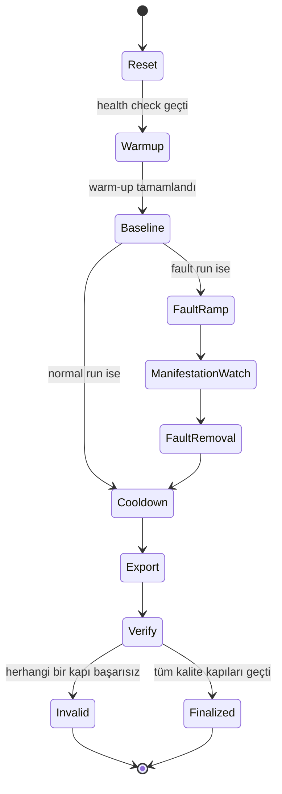

# Datasheet 02 — Akademik Sözleşme

## 1. Neden “sözleşme” diyoruz?

Kodun bazı sabitleri teknik tercih değil, akademik deney tasarımıdır.
Operasyon kodu bunları kolaylık için değiştiremez. Değişiklik gerekiyorsa önce
`research_decisions.md` içine gerekçeli karar eklenmelidir.

## 2. Bağlayıcı invariant'lar

| Konu | Bağlayıcı karar | Kod etkisi |
|---|---|---|
| Deney birimi | Bağımsız `run` | Her artefact `run_id` taşır |
| Split group | `run_id` | Aynı run pencereleri farklı split'lere dağıtılamaz |
| Injection zamanı | `failure_manifestation` değildir | Metadata iki zamanı ayrı tutar |
| Pencere | Varsayılan 5 saniye | Gelecekteki feature builder bunu izlemeli |
| Gözlem | 30 pencere / 150 saniye | Model girdisinin temporal kapsamı |
| Ana horizon | 30 saniye | Etiket `(t, t+30s]` kuralıyla üretilir |
| Duyarlılık | 15 ve 60 saniye | Ayrı analiz; ana sonucu değiştirmez |
| Hata sınıfları | CPU stress, network delay, gelişen degradation | Pilot kanıtına bağlı |
| Ani pod kill | Erken tahmin iddiası yok | RCA negatif kontrolü |
| Primary metrics | event AUPRC, macro-F1, false alarms/hour, detection, lead time, Brier/ECE | Accuracy tek başına yetmez |
| RCA metrics | Top-1, Top-3, MRR | Graph deneylerinin ana ölçümü |
| LLM rolü | classifier değil verifier | `supported/uncertain/contradicted` |

## 3. Run yaşam döngüsü

Mevcut kod yalnızca `Export → Verify → Finalized/Invalid` bölümünü uygular.

## 4. Zaman alanlarının anlamı

- `warmup_start`: sistemi kararlı yük durumuna getirme başlangıcı.
- `injection_start`: perturbation komutunun fiziksel etkiye başladığı zaman.
- `injection_end`: perturbation'ın kaldırıldığı zaman.
- `first_symptom`: önceden tanımlanmış ilk telemetry semptomu.
- `failure_manifestation`: kullanıcıya yansıyan hata veya SLO ihlalinin ilk
  zamanı.
- `recovery_time`: sistemin kararlı normale dönüşü.

`injection_start == failure_manifestation` varsayımı leakage ve yapay lead
time üretir; yasaktır.

## 5. Veri kalite kapıları

Bir run modellemeye ancak şu koşullarda alınabilir:

- zorunlu evre zamanları var,
- run ID bütün modalitelerde eşleşiyor,
- metric/log/trace zamanları mantıklı,
- hedef fault etkisi metrikle doğrulanmış,
- kritik modalitelerin missingness'i kabul edilebilir,
- servis kimlikleri/topoloji çözümlenebilir,
- final receipt doğrulanmış,
- run dışlama gerekçesi yok.

Receipt yalnızca operasyonel kapıdır; fault ve SLO kapılarının yerine geçmez.

## 6. Leakage kontrol listesi

- Aynı run'dan komşu pencereler train ve test'e bölünmez.
- Normalizasyon yalnızca train üzerinde öğrenilir.
- Log template vocabulary yalnızca train üzerinde öğrenilir.
- Threshold ve calibration validation üzerinde seçilir.
- Test verisi SLO eşiği veya manifestation kuralı seçmekte kullanılmaz.
- Manifestation sonrası pencereler proactive prediction dataset'ine girmez.
- Workload veya injection schedule sınıf etiketini ele vermemelidir.

## 7. Kod değişikliğinde araştırmacının sorması gerekenler

1. Bu değişiklik zaman tanımını değiştiriyor mu?
2. Bir run'ın içine başka run verisi girebilir mi?
3. Ham veriyi yeniden yazıyor mu?
4. Başarısız çıktıyı siliyor mu?
5. Test datasına bakarak eşik seçiyor mu?
6. Window-level sonucu event-level gibi raporluyor mu?
7. LLM skorunu kalibre edilmiş olasılık gibi kullanıyor mu?

Herhangi bir sorunun cevabı “evet” ise değişiklik akademik karar incelemesi
gerektirir.
