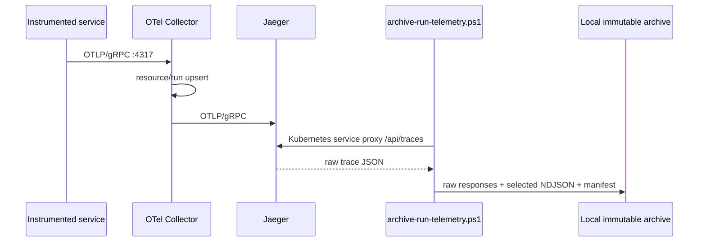
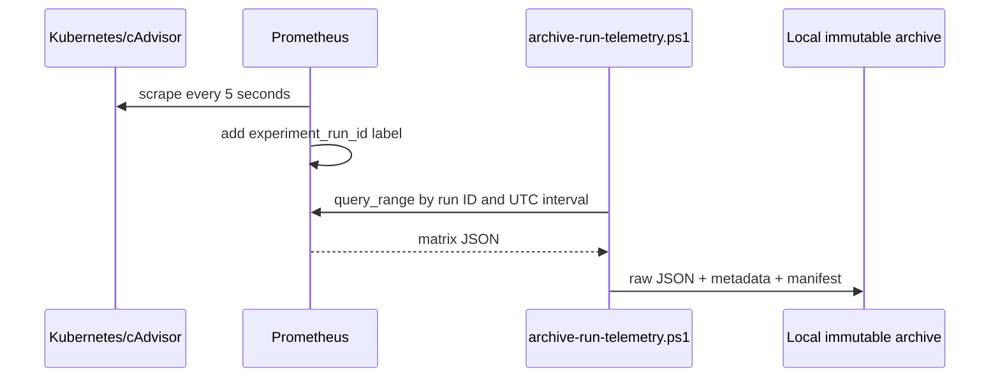
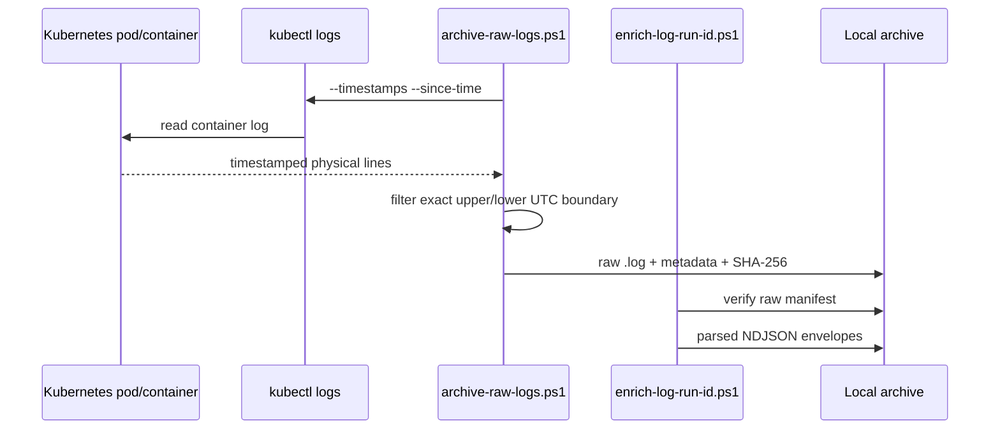

# Datasheet 03 — Araç Zinciri

## 1. Ana bileşenler

| Araç | Rol | Bu projedeki sürüm/ayar |
|---|---|---|
| Docker Desktop | Minikube node'unu çalıştıran container engine | Engine 29.6.1 |
| Minikube | Yerel Kubernetes cluster lifecycle | 1.38.1 |
| Kubernetes | Deployment, Service, ConfigMap ve pod yönetimi | 1.34.0 |
| Kustomize | Upstream manifestlere overlay/patch uygular | kubectl içinde |
| Online Boutique | Mikroservis benchmark sistemi | v0.10.6 |
| OpenTelemetry | Uygulama trace/metric taşıma standardı | Collector 0.155.0 |
| Jaeger | Trace saklama ve query API | all-in-one 1.76.0 |
| Prometheus | Metric scrape ve query_range API | 3.7.3 |
| cAdvisor | Container CPU/memory metrik kaynağı | Kubernetes node endpoint |
| PowerShell | Orkestrasyon, arşivleme ve doğrulama | Windows PowerShell |
| Git/GitHub | Kod, config, rapor ve karar geçmişi | private repository |

## 2. Veri yolları

### Trace yolu

### Metric yolu

### Log yolu

## 3. Neden Kubernetes service proxy?

Metric/trace exporter, ayrı port-forward pencerelerine bağımlı değildir.

`kubectl get --raw` çağrısı:

- Kubernetes API üzerinden Service'e proxy olur,
- localhost port çakışmasını önler,
- background port-forward process yönetimini kaldırır,
- scriptin tek process içinde deterministik çalışmasını kolaylaştırır.

Bu tercih authentication/authorization için mevcut kubeconfig'i kullanır.

## 4. Kustomize neden var?

Online Boutique upstream manifestleri yerelde kopyalanıp fork edilmez.
Kustomize overlay:

- upstream base'i kaynak olarak alır,
- namespace ve observability bileşenlerini ekler,
- yalnızca gerekli deployment'lara environment patch uygular,
- frontend service tipini NodePort yapar,
- emailservice startup probe ekler.

Bu yaklaşım upstream sürüm ile araştırma değişikliklerini ayırır.

## 5. Hangi veri Git'e girer?

Git'e giren:

- scriptler,
- config'ler,
- küçük Markdown raporları,
- sonuç registry,
- datasheet'ler.

Git'e girmeyen:

- upstream source checkout,
- Minikube state,
- ham run logları,
- derived NDJSON,
- metric/trace JSON arşivleri,
- final receipt'in yerel büyük veri bağlantıları,
- makale PDF'leri.

Yerel artefact'ların ayrıca yedeklenmesi gerekir; Git ignore bir backup
mekanizması değildir.

## 6. Operasyonel durum kodları

Scriptler makine-okunur `key=value` satırları üretir:

- `archive_status=sealed-read-only`
- `run_telemetry_verification=passed`
- `run_finalization=passed`
- `close_run=passed`
- `failure_count=N`
- `failure=<reason>`

Bu yapı daha sonra CI veya bir üst orchestration katmanı tarafından parse
edilebilir.
