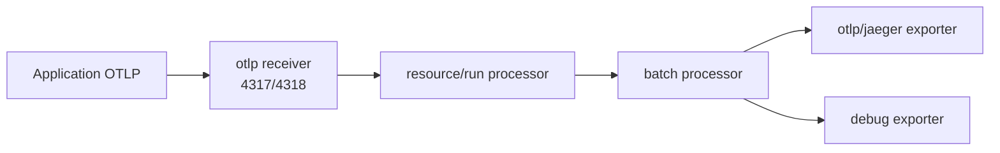
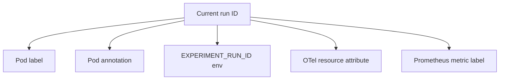

# Datasheet 05 — Kubernetes ve Observability Config

## 1. `versions.yaml`

Bu dosya tekrarlanabilir ortamın sürüm manifestidir:

- Online Boutique tag ve commit,
- Kubernetes,
- Minikube,
- Docker Engine,
- kubectl,
- OTel Collector,
- Jaeger,
- Prometheus,
- scrape interval,
- trace sampler ve ratio.

Yeni image tag veya Kubernetes sürümü yalnızca burada değiştirilip geçilemez;
uyumluluk testi ve akademik kayıt gerekir.

## 2. `namespace.yaml`

Tüm benchmark ve observability kaynaklarını `online-boutique` namespace'ine
yerleştirir. Namespace izolasyonu:

- sorguları sınırlar,
- yanlış cluster kaynağına işlem riskini azaltır,
- artefact metadata'sında tek namespace kullanılmasını sağlar.

## 3. `kustomization.yaml`

### Kaynaklar

- upstream Online Boutique base,
- namespace,
- observability bileşenleri.

### Frontend patch

`frontend-external` Service tipini `NodePort` yapar. Yerel smoke test ve
Minikube erişimi için kullanılır.

### Instrumented deployment patch

Yedi servise uygulanır:

- checkoutservice,
- currencyservice,
- emailservice,
- frontend,
- paymentservice,
- productcatalogservice,
- recommendationservice.

Eklenen environment değerleri:

| Değişken | Anlam |
|---|---|
| `COLLECTOR_SERVICE_ADDR` | OTLP collector endpoint |
| `ENABLE_TRACING=1` | Uygulama tracing'ini açar |
| `DISABLE_PROFILER=1` | Profiler kaynaklı kararsızlığı önler |
| `EXPERIMENT_RUN_ID` | Uygulama/log context için run kimliği |
| `OTEL_SERVICE_NAME` | Pod `app` label'ından servis adı |
| `OTEL_TRACES_SAMPLER` | parent-based ratio sampler |
| `OTEL_TRACES_SAMPLER_ARG=1.0` | Tooling/pilot için yüzde 100 sampling |

Pod label ve annotation olarak da `experiment.run-id` eklenir.

### Email startup probe

Python emailservice'in başlatma gecikmesi nedeniyle deployment'ın erken
başarısız sayılmasını önler. Bu fault davranışını değiştiren bir patch değil,
startup health davranışını düzenleyen operasyonel patch'tir.

## 4. OTel Collector config



`resource/run` her trace ve OTel metric resource'una:

```text
experiment.run_id=<current run>
```

değerini `upsert` eder. `upsert`, alan yoksa ekler; varsa config'teki değerle
değiştirir. Böylece uygulama SDK farklı davransa bile collector katmanı ortak
run ID sağlar.

## 5. Jaeger

`all-in-one`:

- collector,
- storage,
- query API,
- UI

bileşenlerini tek process'te çalıştırır. Yerel pilot için basittir; kalıcı ve
ölçeklenebilir production storage değildir.

Portlar:

- `4317`: OTLP/gRPC ingest,
- `16686`: query API/UI.

Kalıcı volume olmadığı için run kapanmadan export zorunludur.

## 6. Prometheus

Prometheus, Kubernetes node discovery ile cAdvisor endpoint'ini scrape eder.

Akış:

1. Kubernetes node bulunur.
2. Address API server'a çevrilir.
3. Metrics path node proxy cAdvisor yoluna çevrilir.
4. Her sample'a `experiment_run_id` label'ı eklenir.

`scrape_interval=5s`, akademik 5 saniyelik pencereyle aynı değerdedir; ancak
scrape ve feature window aynı kavram değildir. Feature aggregation kodu daha
sonra ayrıca yazılacaktır.

Prometheus deployment'ında `/prometheus` path'i vardır fakat PVC yoktur.
Container/pod restartında kalıcılık garanti edilmez.

## 7. Run ID'nin beş config noktası



`set-experiment-run-id.ps1`, kustomization içinde 3 ve observability içinde 2
eşleşme bekler. Sayı değişirse script fail-fast olur; bu, config yapısı
değiştiğinde sessiz eksik güncellemeyi önler.

## 8. Config'te bilinmesi gereken sınırlar

- Run ID şu anda dosyaya literal olarak yazılır; deployment öncesi benzersiz ID
  atanmalıdır.
- Jaeger/Prometheus PVC kullanmaz.
- Prometheus yalnızca mevcut cAdvisor scrape config'ini arşivler; uygulama
  request latency/error metric kapsamı ayrıca doğrulanmalıdır.
- `OTEL_TRACES_SAMPLER_ARG=1.0` veri hacmini yükseltir; pilot sonrası sampling
  kararı akademik kayda bağlıdır.
- `kubectl 1.36.2` ile cluster `1.34.0` arasında minor version farkı uyarısı
  vardır; komutlarda `minikube kubectl` tercih edilir.
