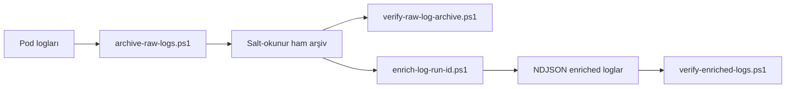

# Run ID ve Log Veri Hattı

## Amaç

Kubernetes ham container loglarının her satırında `run_id` bulunmayabilir.
Proje bunu ham kanıtı değiştirmeden çözer:



Ham arşiv kanıttır; enriched arşiv ham kanıttan yeniden üretilebilen,
modelleme öncesi standart temsildir.

## Run ID değişimi

`set-experiment-run-id.ps1`, `CurrentRunId` ve daha önce kullanılmamış
`NewRunId` alır. Şu güvenlik kontrollerini yapar:

1. ID biçimlerini doğrular ve eşit olmalarını reddeder.
2. Yeni ID'ye ait ham veya derived artefact varsa işlemi durdurur.
3. `kustomization.yaml` içinde eski ID'yi tam üç yerde bekler.
4. `observability.yaml` içinde eski ID'yi tam iki yerde bekler.
5. İki güncellemeyi bellekte hazırlar ve BOM'suz UTF-8 yazar.
6. Yazılan değer sayılarını tekrar doğrular.
7. Bir hata olursa iki dosyayı önceki içeriklerine geri döndürür.
8. Son dosyaların SHA-256 değerlerini raporlar.

`3 + 2` konumu:

| Katman | Alan | Neden? |
|---|---|---|
| Pod | label | Kubernetes kaynak seçimi |
| Pod | annotation | Görünür metadata |
| Proses | `EXPERIMENT_RUN_ID` | Uygulama log bağlamı |
| OTel | `experiment.run_id` | Trace/OTLP resource |
| Prometheus | `experiment_run_id` | Metric series label |

Bu gerçek bir veritabanı transaction'ı değil, iki dosyalı geri alma
mekanizmasıdır.

## Ham log arşivleme

`archive-raw-logs.ps1` şu girdileri alır:

- `RunId`
- `SinceUtc`
- isteğe bağlı `UntilUtc`
- namespace, Minikube profile ve artefact kökü

UTC değerlerinin `Z` ile biten ISO-8601 string olması, PowerShell'in yerel
kültür/saat dilimi dönüşümünü engeller.

Betik:

1. Deployment'lardaki run ID'nin istenen tek değer olduğunu doğrular.
2. Pod/container listesini Kubernetes JSON çıktısından çıkarır.
3. Her container için timestamp'li logları toplar.
4. Fiziksel Kubernetes timestamp'ine göre zaman penceresini uygular.
5. Kayıt yoksa gerçek sıfır baytlık dosya üretir.
6. Metadata ve SHA-256 manifesti oluşturur.
7. Dosyaları salt-okunur yapar.
8. Kısmi başarısızlığı `_invalid` altında korur.

Boş loga yapay newline eklenmez. Aksi halde enrichment bunu “timestamp'i
olmayan olay” sanır; “hiç olay yok” gözlemi bozulur.

## Ham arşiv doğrulama

`verify-raw-log-archive.ps1`, üretici betiğin mesajına güvenmez; diskten:

- manifest yollarını ve dosya setini,
- SHA-256 değerlerini,
- manifest dışı dosyaları,
- salt-okunur nitelikleri,
- timestamp parse sonucunu,
- run başlangıç/bitiş sınırlarını

yeniden doğrular.

## Enrichment

`enrich-log-run-id.ps1`, her fiziksel satırı NDJSON zarfına alır:

```json
{
  "schema_version": 1,
  "transform_version": "log-envelope-v1",
  "run_id": "ob-example-001",
  "system": "online-boutique",
  "service": "frontend",
  "pod": "frontend-abc123",
  "container": "server",
  "timestamp": "2026-07-25T12:00:00.000000000Z",
  "timestamp_status": "kubernetes-prefix",
  "raw_message": "{\"message\":\"request complete\"}",
  "source_file": "raw/logs/frontend-abc123__server.log",
  "source_line_number": 1,
  "source_sha256": "..."
}
```

Farklı dillerin log biçimleri `raw_message` içinde korunur. Provenance zinciri
`source_file + source_line_number + source_sha256` üçlüsüdür.

`verify-enriched-logs.ps1`; manifest, JSON, zorunlu alan, run ID, timestamp,
kaynak satır sırası, kayıt sayısı, beklenmeyen dosya ve salt-okunur durumunu
bağımsız doğrular.

## Araştırmacı kontrol listesi

- Deployment run ID'si istenen değer mi?
- Zaman penceresi run metadata ile aynı mı?
- Mevcut arşivin üzerine yazma reddediliyor mu?
- Kısmi hata `_invalid` altında mı?
- Boş log gerçekten sıfır bayt mı?
- Enriched kayıt ham satıra geri izlenebiliyor mu?
- Beklenmeyen dosya doğrulayıcı tarafından reddediliyor mu?
