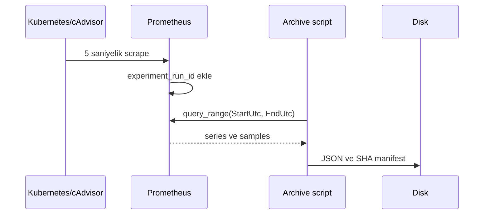
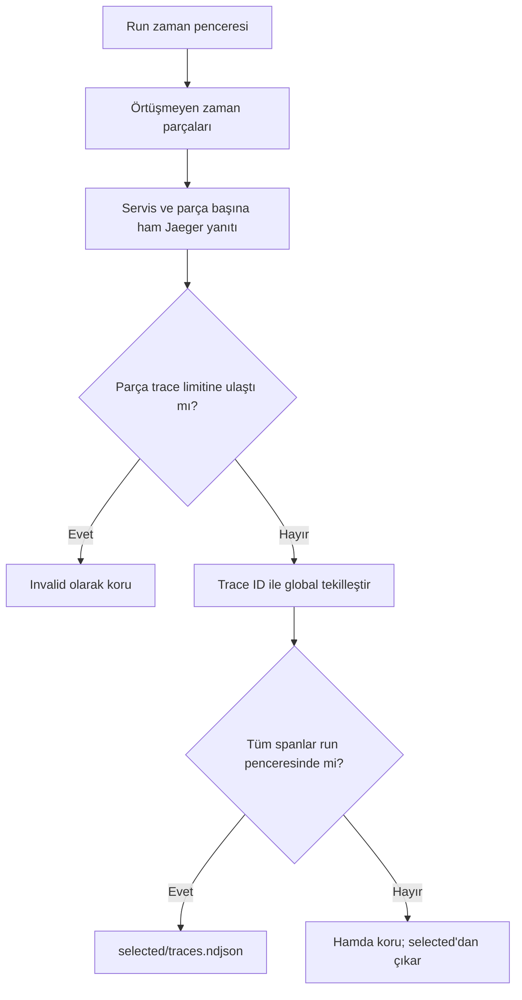

# Metric ve Distributed Trace Export

## Neden export gerekiyor?

Prometheus ve Jaeger kalıcı volume kullanmaz. Cluster/pod yeniden başlarsa veri
kaybolabilir veya aynı run ID ile yeni telemetry oluşabilir. Arayüzde veri
görülmesi yeterli değildir; run bitmeden immutable dışa aktarım ve bağımsız
doğrulama gerekir.

İlgili dosyalar:

- `archive-run-telemetry.ps1`
- `verify-run-telemetry.ps1`

## Metric hattı

Prometheus'a zaman aralıklı sorgu uygulanır. Temel üyelik filtresi:

```promql
{experiment_run_id="ob-example-001"}
```



Doğrulayıcı her serinin run ID'sini, her örneğin zaman sınırını ve metadata
sayaçlarını diskten yeniden kontrol eder.

## Trace hattı

Jaeger API servis ve zaman parçası bazlı sorgulanır:

1. servis listesi alınır;
2. run penceresi varsayılan olarak 300 saniyelik, örtüşmeyen parçalara ayrılır;
3. her servis ve parça için ham trace yanıtı ayrı saklanır;
4. parça sınırları metadata içinde kaydedilir;
5. trace ID'ler servisler ve parçalar genelinde benzersizleştirilir;
6. bütünüyle run penceresinde kalan trace'ler seçilir.

Bir trace sınırı kesiyorsa yalnızca içerdeki spanları almak çağrı ağacını
bozar. Schema v3 bu trace'i ham kanıtta tutar, selected kümeden çıkarır.
Bir parçada Jaeger limitine ulaşılırsa çıktı kırpılmış kabul edilmez; arşiv
`invalid` olarak korunur ve daha küçük `TraceQueryChunkSeconds` ile yeni,
benzersiz bir tooling run gerekir.



| Sayaç | Anlam |
|---|---|
| `trace_chunk_count` | Bütün servisler için üretilen ham sorgu parçası |
| `trace_response_count` | Parça yanıtlarındaki toplam trace; tekrar içerebilir |
| `raw_unique_trace_count` | Ham yanıtlardaki benzersiz trace |
| `boundary_excluded_trace_count` | Run sınırını kesen trace |
| `unique_trace_count` | Tamamen pencere içindeki trace |
| `selected_span_count` | Seçilmiş trace'lerin span toplamı |

## Service name ve sampling

`OTEL_SERVICE_NAME`, pod'un `app` label'ından Kubernetes Downward API ile
alınır. Böylece `unknown_service:*` yerine kararlı servis adları kullanılır.

Sampling:

```text
OTEL_TRACES_SAMPLER=parentbased_traceidratio
OTEL_TRACES_SAMPLER_ARG=1.0
```

Pilot hazırlığında kök trace'ler yüzde 100 örneklenir; çocuk spanlar parent
kararını izler. Bu oran değiştirilirse protokol ve config revision da
değişmelidir.

## Başarı ölçütleri

- Bütün manifest girdileri doğrulanmış
- Manifest dışı dosya yok
- Metric ve trace run ID mismatch sıfır
- Metric zaman hatası sıfır
- Selected trace zaman/JSON hatası sıfır
- Parça indeks, zaman kapsamı ve dosya özeti hatası sıfır
- Her parçadaki trace sayısı Jaeger limitinin altında
- Metadata sayaçları gerçek veriden hesaplananlarla aynı

Yüksek kayıt sayısı tek başına başarı değildir; doğru run ve doğru zaman
penceresi daha önemlidir.

## 30 dakikalık canlı doğrulama

`P1-TRACE-CHUNK-LIVE-001`, schema v3 hattını gerçek Online Boutique yükünde
doğruladı:

| Ölçüm | Sonuç |
|---|---:|
| Run süresi | 30 dakika 27 saniye |
| Servis | 7 |
| Zaman parçası | 49 |
| En yoğun parça | 924 / 5000 trace |
| Ham trace yanıtı | 21.647 |
| Ham benzersiz trace | 9.443 |
| Selected trace | 9.441 |
| Selected span | 100.056 |
| Parça kapsam hatası | 0 |
| Run ID/zaman hatası | 0 |

Bu çalışma tooling kapısıdır; fault injection veya bilimsel dataset değildir.

## Sınırlar

- Export cluster kapanmadan yapılmalıdır.
- Jaeger aynı trace'i birden fazla servis yanıtında döndürebilir.
- Jaeger aynı trace'i komşu zaman sorgularında da döndürebilir; global trace ID
  tekilleştirmesi zorunludur.
- Varsayılan 300 saniyelik parça mutlak bir kapasite garantisi değildir. Limit
  yine dolarsa parça süresi azaltılmalıdır.
- Prometheus çıktısı büyük olabilir.
- Aynı run ID'nin tekrar kullanılması veri kontaminasyonudur.
- Raw boundary trace silinmez; bilimsel selected kümeden ayrılır.
