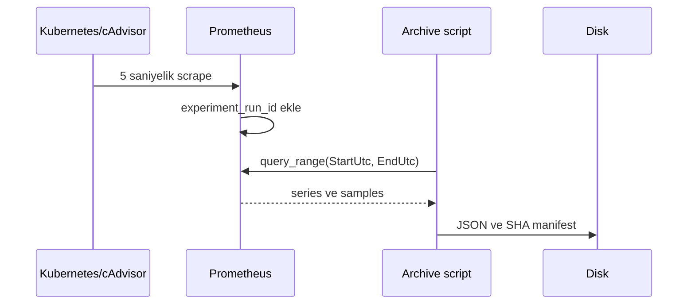
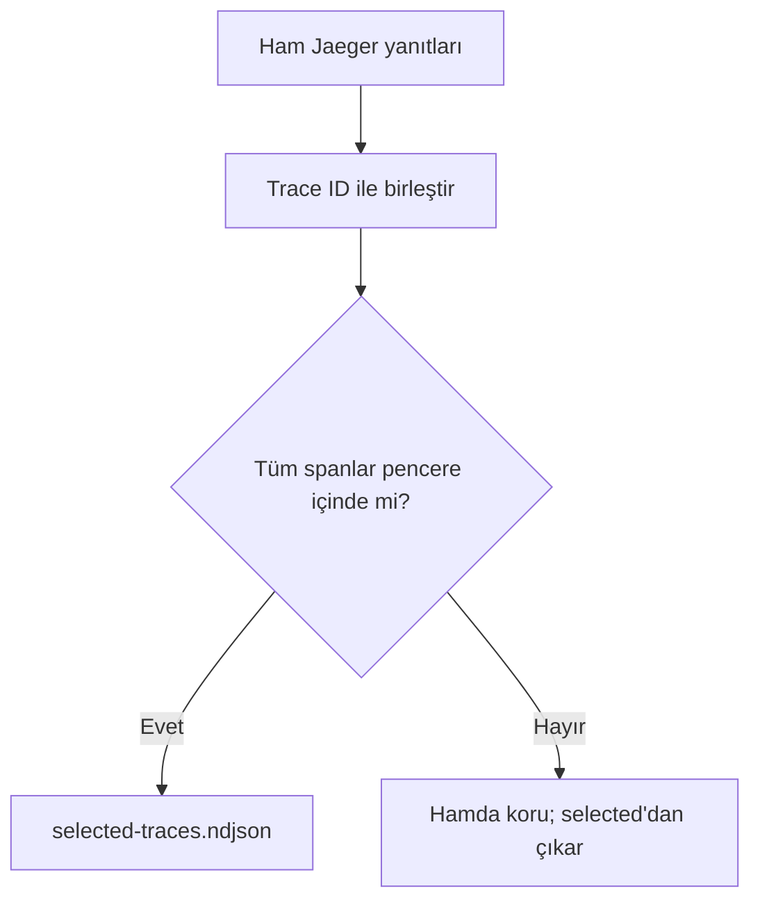

# Metric ve Distributed Trace Export

## Neden export gerekiyor?

Prometheus ve Jaeger kalıcı volume kullanmaz. Cluster/pod yeniden başlarsa veri
kaybolabilir veya aynı run ID ile yeni telemetry oluşabilir. Arayüzde veri
görülmesi yeterli değildir; run bitmeden immutable dışa aktarım ve bağımsız
doğrulama gerekir.

İlgili dosyalar:

- `archive-run-telemetry.ps1`
- `verify-run-telemetry.ps1`

## Metric hattı

Prometheus'a zaman aralıklı sorgu uygulanır. Temel üyelik filtresi:

```promql
{experiment_run_id="ob-example-001"}
```



Doğrulayıcı her serinin run ID'sini, her örneğin zaman sınırını ve metadata
sayaçlarını diskten yeniden kontrol eder.

## Trace hattı

Jaeger API servis bazlı sorgulanır:

1. servis listesi alınır;
2. her servis için ham trace yanıtı saklanır;
3. trace ID'ler benzersizleştirilir;
4. bütünüyle run penceresinde kalan trace'ler seçilir.

Bir trace sınırı kesiyorsa yalnızca içerdeki spanları almak çağrı ağacını
bozar. Schema v2 bu trace'i ham kanıtta tutar, selected kümeden çıkarır.



| Sayaç | Anlam |
|---|---|
| `raw_unique_trace_count` | Ham yanıtlardaki benzersiz trace |
| `boundary_excluded_trace_count` | Run sınırını kesen trace |
| `unique_trace_count` | Tamamen pencere içindeki trace |
| `selected_span_count` | Seçilmiş trace'lerin span toplamı |

## Service name ve sampling

`OTEL_SERVICE_NAME`, pod'un `app` label'ından Kubernetes Downward API ile
alınır. Böylece `unknown_service:*` yerine kararlı servis adları kullanılır.

Sampling:

```text
OTEL_TRACES_SAMPLER=parentbased_traceidratio
OTEL_TRACES_SAMPLER_ARG=1.0
```

Pilot hazırlığında kök trace'ler yüzde 100 örneklenir; çocuk spanlar parent
kararını izler. Bu oran değiştirilirse protokol ve config revision da
değişmelidir.

## Başarı ölçütleri

- Bütün manifest girdileri doğrulanmış
- Manifest dışı dosya yok
- Metric ve trace run ID mismatch sıfır
- Metric zaman hatası sıfır
- Selected trace zaman/JSON hatası sıfır
- Metadata sayaçları gerçek veriden hesaplananlarla aynı

Yüksek kayıt sayısı tek başına başarı değildir; doğru run ve doğru zaman
penceresi daha önemlidir.

## Sınırlar

- Export cluster kapanmadan yapılmalıdır.
- Jaeger aynı trace'i birden fazla servis yanıtında döndürebilir.
- Prometheus çıktısı büyük olabilir.
- Aynı run ID'nin tekrar kullanılması veri kontaminasyonudur.
- Raw boundary trace silinmez; bilimsel selected kümeden ayrılır.
