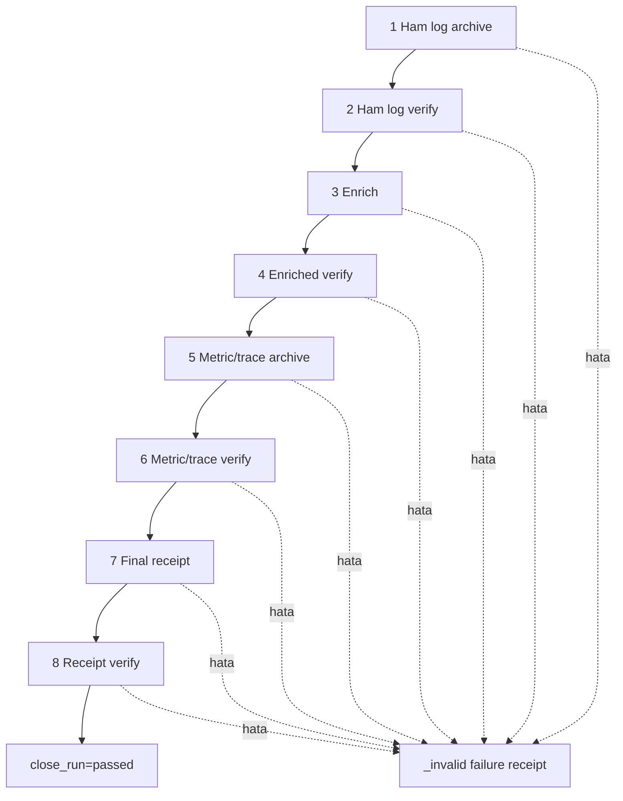

# Run Finalization ve Bütünlük

## Amaç

Finalization üç doğrulanmış veri ailesini tek receipt altında bağlar:

1. ham log arşivi,
2. enriched log arşivi,
3. metric/trace arşivi.

Dosyalar:

- `finalize-run-artifacts.ps1`
- `verify-finalized-run.ps1`
- `close-run.ps1`

## Receipt

Receipt veriyi kopyalamaz; artefact yollarını, manifest hashlerini, ortak zaman
penceresini ve sayaçları bağlar:

```json
{
  "run_id": "ob-example-001",
  "start_utc": "2026-07-25T18:16:25.018Z",
  "end_utc": "2026-07-25T18:17:10.026Z",
  "metric_sample_count": 47546,
  "unique_trace_count": 152,
  "enriched_record_count": 1109,
  "valid_for_modeling": true
}
```

`valid_for_modeling=true` yalnızca operasyonel bütünlük kapısıdır. Fault
etkisinin gerçekleştiğini, SLO manifestasyonunu, warm-up ayrımını, split
manifestini veya bilimsel kabulü tek başına kanıtlamaz.

## Offline doğrulama

`verify-finalized-run.ps1`, Docker/Kubernetes olmadan receipt'i ve bağlı yerel
artefact'ları doğrular. Böylece canlı ortam değişse de mühürlenmiş sonucun
bütünlüğü kontrol edilebilir.

## Close-run orkestrasyonu



Her alt betik ayrı PowerShell prosesinde çalışır. Bu; scope, StrictMode,
değişken ve exit-code sınırlarını ayırır. İlk hata süreci durdurur ve
`failed_step`, child exit code ve mevcut çıktı durumunu invalid receipt'e yazar.

## Overwrite ve mühür

Başarılı çıktı aynı run ID ile overwrite edilmez. Kısmi çıktı `_invalid`
altında korunur. Windows `ReadOnly` niteliği yanlışlıkla düzenlemeyi engeller
ama gerçek WORM değildir; asıl kontrol SHA-256, tam dosya seti ve bağımsız
verifier zinciridir.

Başarılı kapanıştan sonra araştırmacı:

- `close_run=passed` sonucunu,
- log/metric/trace sayaçlarını,
- boundary-excluded trace sayısını,
- offline receipt doğrulamasını,
- host/cluster kontaminasyonu bulunmadığını,
- deneysel metadata'nın ayrıca tamamlandığını

kontrol etmelidir.
