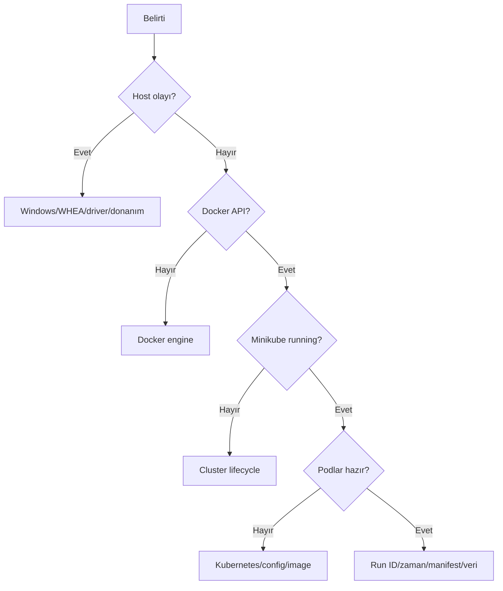

# Failure Modes ve Debugging

## Katmanı önce belirleyin



## Sık hatalar

### Docker API bulunamıyor

`npipe:////./pipe/dockerDesktopLinuxEngine` hatası CLI'ın değil Linux engine'in
çalışmadığını gösterir. Docker Desktop hazır olduktan sonra `docker info` ile
kontrol edin.

### Minikube stopped

`host/kubelet/apiserver: Stopped` ise `deploy.ps1` ile proje environment
değişkenlerini kullanarak başlatın.

### Container içinde `printenv` yok

Minimal image tanılama binary'si içermeyebilir. Bu env değerinin yokluğunu
kanıtlamaz. Deployment'ı `-o json` alın, `ConvertFrom-Json` ile `env` listesini
inceleyin.

### JSONPath tırnak sorunu

PowerShell ile `[]`, `?()` ve tırnaklar çatışabilir. JSON alıp nesne sorgulamak
daha güvenlidir:

```powershell
$d = minikube kubectl --profile p0-online-boutique -- `
  -n online-boutique get deployment frontend -o json |
  ConvertFrom-Json
$d.spec.template.spec.containers[0].env |
  Where-Object name -eq 'EXPERIMENT_RUN_ID'
```

### `.Count` property bulunamadı

Pipeline tek sonuçta scalar döndürebilir. Güvenli kalıp:

```powershell
$items = @($possiblySingleResult)
$items.Count
```

### NativeCommandError

Child proses stderr'i PowerShell'de kırmızı hata gibi görünür. Kararı
`$LASTEXITCODE`, child exit code ve betiğin başarı belirteciyle verin.

### Run ID mismatch

İstenen ve deployed ID farklıysa reddetme beklenen güvenlik davranışıdır.
Yanlış ID için veri artefact'ı oluşmamalı; failure receipt korunmalıdır.

### Trace zaman hatası

Run sınırını kesen trace'i span bazında parçalamayın. Hamda koruyun,
`boundary_excluded` olarak sayın ve selected complete trace kümesinden çıkarın.

## Jaeger sorgu limiti

Belirti:

```text
Jaeger trace limit reached ... archive would be truncated
```

Bu hata veri kaybını önleyen bir kapıdır. Limiti artırıp sonucu olduğu gibi
kabul etmek yerine run penceresini örtüşmeyen zaman parçalarına bölün.
Schema v3 her servis/parça yanıtını ayrı saklar ve trace ID'leri bütün parçalar
genelinde tekilleştirir. Bir parça yine limite ulaşıyorsa
`TraceQueryChunkSeconds` değerini azaltarak yeni ve benzersiz bir tooling run
oluşturun. Geçersiz arşivi silmeyin.

### Boş logda eksik timestamp

Gerçek boş log sıfır bayt olmalıdır. Yapay newline sahte bir enriched kayıt
üretir.

### Beklenmeyen manifest dosyası

`unexpected_unmanifested_file` ve `readonly_mismatch` negatif testte beklenen
reddetmedir; arşiv dosya kümesi değişmiştir.

### UTF-8 mojibake

`Sonuçları` görünümü çoğu zaman terminal code page problemidir. Dosyayı açıkça
UTF-8 ile okuyun; BOM'suz UTF-8 helper'ları bu nedenle kullanılır.

## Host kararlılığı

Gözlenen olaylar:

- `DPC_WATCHDOG_VIOLATION (0x133)`
- WHEA Event 17
- PCIe Root Port `00:1D.5`
- MediaTek MT7921 yoluyla ilişki
- Wi-Fi kapalıyken dahi tekrarlanan düzeltilmiş WHEA

Host kesintisi workload'u ve ephemeral Prometheus/Jaeger verisini kontamine
eder. Bu nedenle ayrı bir stop gate'tir.

## Yapılmaması gerekenler

- Invalid artefact'ı silmek
- Mühürlü ham logu elle düzeltmek
- Run ID'yi yeniden kullanmak
- Hatalı spanları sessizce silmek
- Test verisine göre SLO eşiği değiştirmek
- Restart sonrası telemetry'yi eski run'a kabul etmek
- Deployment readiness'i tam E2E başarı saymak
