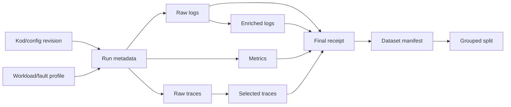

# Artefact ve Şemalar

## Dizin

```text
p0-env/artifacts/
├── P*-*/                    # Git'te küçük insan-okur raporlar
├── runs/<run_id>/           # Git dışı ham loglar
├── derived/<run_id>/        # Git dışı enriched NDJSON
├── telemetry/<run_id>/      # Git dışı metric/trace
├── finalized/<run_id>/      # Git dışı receipt
└── */_invalid/              # Korunan başarısız denemeler
```

## Ortak manifest

```json
[
  {
    "path": "raw/logs/frontend-abc__server.log",
    "sha256": "0123456789abcdef..."
  }
]
```

Yollar relative olmalı, arşiv dışına çıkmamalı, hashler eşleşmeli ve arşivde
manifest dışı dosya bulunmamalıdır.

## Ham log metadata

| Alan | Anlam |
|---|---|
| `run_id` | Benzersiz run |
| `system`, `namespace` | Kaynak sistem |
| `code_revision` | Git revision |
| `deployment_revision` | Config hash |
| `since_utc`, `until_utc` | Toplama penceresi |
| `capture_completed_utc` | Arşivleme bitişi |
| `raw_log_file_count` | Container log sayısı |

Fiziksel log satırı Kubernetes UTC prefix'i ve orijinal mesajdan oluşur.

## Enriched NDJSON

| Alan | Rol |
|---|---|
| `schema_version`, `transform_version` | Şema/dönüşüm versiyonu |
| `run_id`, `system` | Deney üyeliği |
| `service`, `pod`, `container` | Kaynak instance |
| `timestamp`, `timestamp_status` | Zaman ve çıkarım durumu |
| `raw_message` | Değiştirilmemiş mesaj |
| `source_file`, `source_line_number`, `source_sha256` | Provenance |

Bu model feature şeması değildir.

## Metric örneği

```json
{
  "metric": {
    "__name__": "container_cpu_usage_seconds_total",
    "pod": "frontend-abc",
    "experiment_run_id": "ob-example-001"
  },
  "values": [[1785000000.0, "12.34"]]
}
```

Prometheus değerleri string gelebilir; sayısal dönüşüm feature üretiminde
versioned olmalıdır.

## Trace özetleri

| Alan | Anlam |
|---|---|
| `raw_unique_trace_count` | Ham benzersiz trace |
| `boundary_excluded_trace_count` | Sınırı kesen trace |
| `unique_trace_count` | Tam seçilmiş trace |
| `selected_span_count` | Seçilmiş span toplamı |

## Failure receipt

Başarısız kapanış `run_id`, `status=invalid`, `failed_step`,
`child_exit_code`, `existing_outputs` ve hata zamanını korur.

## Deney metadata sözleşmesi

```yaml
run_id: ob-cpu-cart-001
system: online-boutique
code_revision: "<git sha>"
deployment_revision: "<config sha>"
fault_class: cpu_stress
target_service: "<service>"
fault_profile: "<profile id>"
workload_profile: "<profile id>"
random_seed: 1
warmup_start: "<UTC ISO-8601>"
injection_start: "<UTC ISO-8601>"
injection_end: "<UTC ISO-8601>"
first_symptom: null
failure_manifestation: null
recovery_time: null
operator_notes: ""
```

Mevcut finalization araçları bu deneysel alanların tamamını otomatik üretmez.
P1 fault run öncesinde lifecycle metadata aracı bu sözleşmeyi tamamlamalıdır.

## Lineage



Dataset manifest ve grouped split henüz bu operasyonel araç paketinin çıktısı
değildir.
