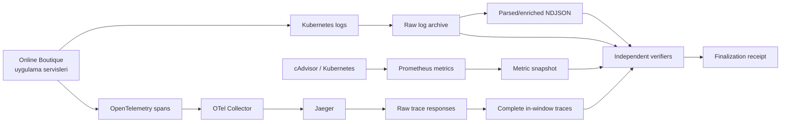

# Araştırmacı Datasheet Kütüphanesi

Bu klasör, repository'deki operasyon kodunu yalnızca “çalıştırılacak
PowerShell komutları” olarak değil, araştırmanın veri üretim sistemi olarak
anlatır. Hedef okuyucu; Python, C/C++, C# veya Java bilen, fakat PowerShell,
Kubernetes ve observability ekosistemine yeni olan yazılım mühendisidir.

## Bu belgeler nasıl okunmalı?

Önerilen sıra:

1. [Proje mimarisi](01-project-architecture.md)
2. [Akademik sözleşme ve değiştirilemez kurallar](02-research-contract.md)
3. [Araç zinciri datasheet'i](03-toolchain-datasheet.md)
4. [PowerShell ekosistemi ve dil eşleştirmeleri](04-powershell-ecosystem.md)
5. [Kubernetes ve observability config'leri](05-kubernetes-observability-config.md)
6. [Run ID, ham log ve enrichment hattı](06-run-id-and-log-pipeline.md)
7. [Metric ve trace export hattı](07-metric-trace-export.md)
8. [Finalization, checksum ve güven modeli](08-finalization-and-integrity.md)
9. [Dosya dosya kod haritası](09-file-by-file-code-map.md)
10. [Araştırmacı operasyon runbook'u](10-operator-runbook.md)
11. [Hata modları ve debugging](11-failure-modes-and-debugging.md)
12. [Artefact ve JSON şemaları](12-artifact-schemas.md)

## Hızlı zihinsel model

Bu repository'deki PowerShell kodu bir “deney algoritması” değildir. Şu anda
bir **veri toplama ve kanıt zinciri**dir:

`Finalization receipt` yoksa run bilimsel modellemeye uygun kabul edilmez.
Receipt olsa bile fault metadata, zorunlu evre zamanları ve veri kalite
kapıları ayrıca sağlanmalıdır.

## Mevcut aşama

- P0 ortam kurulumu tamamlandı.
- Run ID propagation, trace service name ve sampling ayarları eklendi.
- Ham log, enriched log, metric ve trace arşivleme/doğrulama hattı çalışıyor.
- Tek-komut `close-run.ps1` tooling testinde bütün kapıları geçti.
- Fault injection, temporal model, LLM doğrulaması ve GAT uygulanmadı.
- Yerel hostta PCIe WHEA hataları tekrarlandığı için bilimsel deney başlatmak
  hâlâ yasaktır.

## Kod inceleme yaklaşımı

Her script için beş soruyu cevaplayın:

1. Girdi nedir?
2. Hangi external state'i okur veya değiştirir?
3. Başarı çıktısı nedir?
4. Hangi durumda fail-fast olur?
5. Başarısızlık kanıtı nerede korunur?

Bu soruların cevapları özellikle
[dosya dosya kod haritasında](09-file-by-file-code-map.md) bulunur.
