# ob-netdelay-15u-repeat-001 geçerli run raporu

`ob-netdelay-15u-repeat-001`, D-058/D-059 randomizasyon çizelgesinin ilk
`fault-control` bloğundaki fault slotudur. Canonical revision `0b501a3`, workload
`ob-second-15u-1r-v1` (`15/1/seed 1`), hedef edge
`recommendationservice -> productcatalogservice` ve 500m/100m server/proxy kaynak
sözleşmesi altında geçerli tamamlandı.

## Araştırmanın mevcut konumu

```mermaid
flowchart LR
    A[P0: ortam ve telemetri] --> B[P1: CPU fault pilotu]
    B --> C[P2: network-delay tasarım ve altyapı kapıları]
    C --> D[008: ilk geçerli pilot]
    D --> E[repeat-001: ilk randomize fault tekrarı]
    E --> F[control-001: eşlenmiş no-toxic kontrol]
    F --> G[Kalan 3 eşlenmiş blok]
    G --> H[Örnek büyüklüğü ve Dataset v1 akademik kararı]

    classDef done fill:#d8f3dc,stroke:#2d6a4f,color:#000;
    classDef current fill:#ffe8a1,stroke:#9c6b00,color:#000;
    classDef pending fill:#eeeeee,stroke:#666,color:#000;
    class A,B,C,D,E done;
    class F current;
    class G,H pending;
```

Şu anda P2 tekrarlanabilirlik iç pilotundayız. İlk bağımsız randomize fault tekrarı
geçti; birinci blok, eşlenmiş `control-001` tamamlanmadan kapanmış değildir.

## Ne yapıldı, ne ölçüldü, ne test edildi?

| İşlem | Ölçüm/test | Sonuç | Temel savunma tezindeki değeri |
|---|---|---|---|
| Aynı workload ve edge altında 0->750 ms ramp | D-038, ramp süresi ve toxic API read-back | 25 gözlem/restart 0; ramp `120,040 sn` | Hatanın bilinen yerde ve zamanda kontrollü uygulandığını kanıtlar |
| Baseline ve steady target-edge trace karşılaştırması | 5 sn gerçek pencereler, median caller latency | `5,548 -> 755,171 ms`; fark `+749,623 ms`; coverage `60/60` | Komut başarısı yerine gözlenen fiziksel etkiyi kanıtlar |
| Frozen first-symptom ve SLO replay | İlk semptom ve failure manifestation UTC | İlk semptom `07:44:36.901Z`; manifestation `07:45:51.901Z` | Injection, erken semptom ve kullanıcı etkisini ayrı zamanlar olarak etiketler |
| Cleanup/cooldown/rollback | `toxics=[]`, pod snapshot, base deployment ve host RecordId | Cleanup/rollback geçti; host `0/0/0` | Etkinin kalıntı veya host arızasıyla karışmadığını sınırlar |
| Çok-modlu arşiv ve replay | Raw/enriched/schema-v3/final receipt | 17/17, 17/17, 39/39, 7/7; hata 0 | Sonucun yeniden oynatılabilir ve tahrifata duyarlı kanıt zincirini kurar |
| İki-shell portability replay | Windows PowerShell 5.1 ve pwsh 7 | İkisinde de `after_end=0` | Bilimsel zaman sınırının shell tip dönüşümüne bağlı olmadığını gösterir |

## Bilimsel sonuçlar

Lifecycle süreleri warm-up/baseline/ramp/steady/cooldown için sırasıyla
`300,039/300,001/120,040/300,003/300,000 sn` oldu. Baseline 827, steady 683 hedef-edge
spanı içerdi. İlk semptom injection başlangıcından `29,397 sn`, manifestation
`104,397 sn` sonra oluştu.

Schema-v3 arşivi 4.315 metric serisi, 1.098.962 metric örneği, 35 trace chunk,
8.573 ham/8.570 seçili trace ve 106.453 span içerir. Üç boundary-crossing trace hamda
korundu ve selected analiz katmanından dışlandı. Enriched log sayısı 59.532'dir.

Pilot `008` ile birlikte fiziksel etkiler `751,995/749,623 ms`; iki-run ortalaması
`750,809 ms`, sample SD yaklaşık `1,677 ms`, CV yaklaşık `%0,223`tür. İlk semptom
gecikmeleri `29,504/29,397 sn`; manifestation gecikmeleri `99,504/104,397 sn`dir.
Bu değerler ilk bağımsız tekrar için güçlü betimsel tutarlılıktır; eşlenmiş kontrol ve
kalan bloklar tamamlanmadan genel tekrarlanabilirlik, model başarısı veya Dataset v1
yeterliliği iddiası değildir.

## Kapanış

Run geçerlidir ve D-058 fault tekrar kanıtına eklenebilir. Birinci randomize blok henüz
`1/2` slottadır; sıradaki değişmez slot `ob-netdelay-15u-control-001`dir. Control
tooling/ön-kayıt ayrı canonical commit ve canlı onayla yürütülmelidir. Fault sonucuna
bakarak kontrol eşiği, sıra veya SLO değiştirilemez.

**What knowledge did I gain from this step?** Aynı 500 ms network-delay sözleşmesinin
farklı bir zamanda ve bağımsız lifecycle'da yaklaşık 750 ms fiziksel etki, yaklaşık
29,4 sn ilk-semptom gecikmesi ve yaklaşık 100-104 sn manifestation gecikmesi ürettiği;
bu sonucun shell, telemetry veya host kapısı ihlalinden kaynaklanmadığı öğrenildi.
